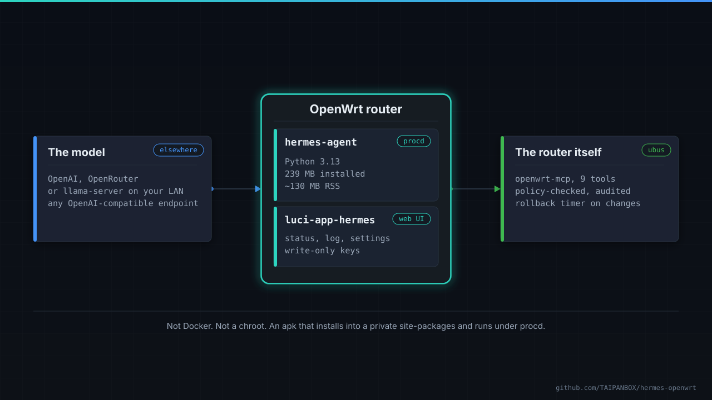
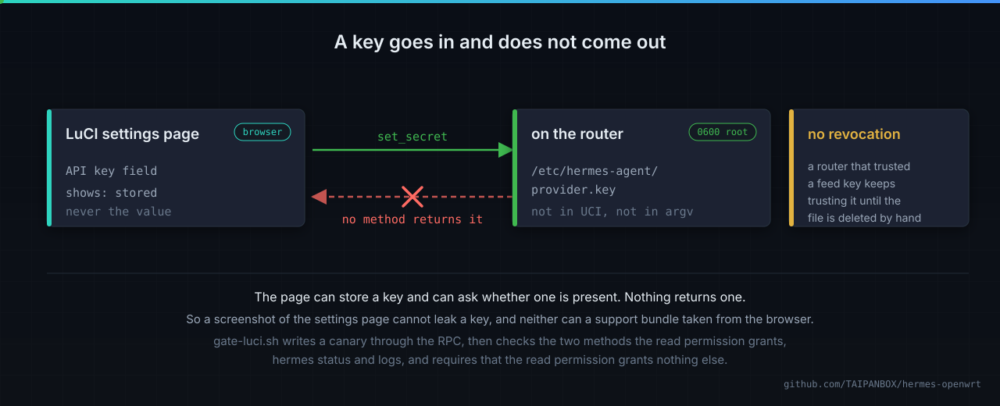
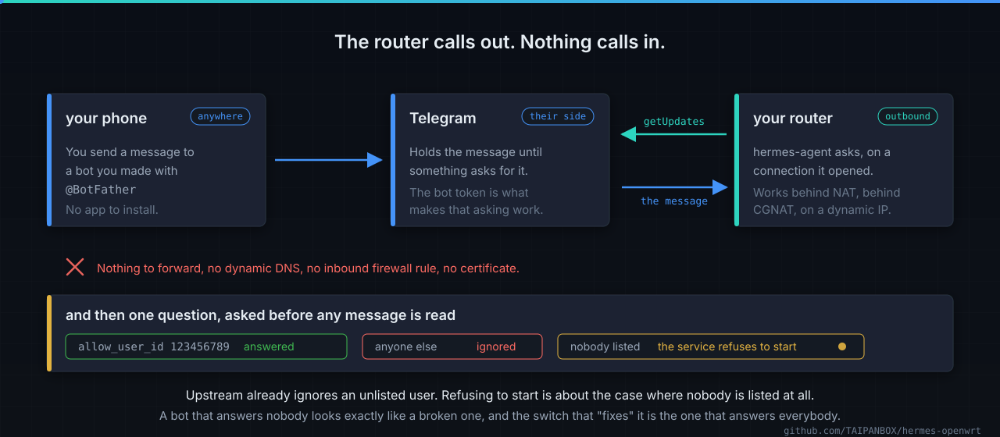
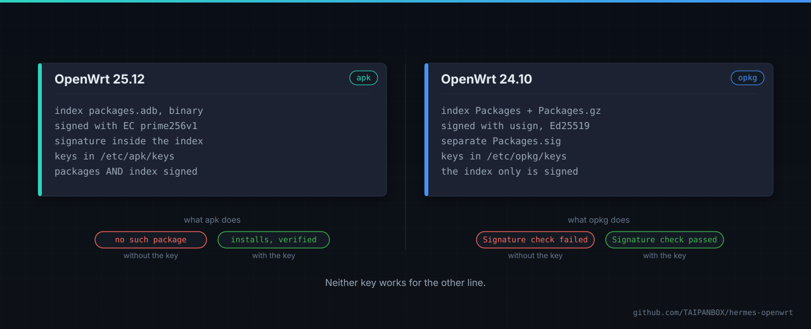
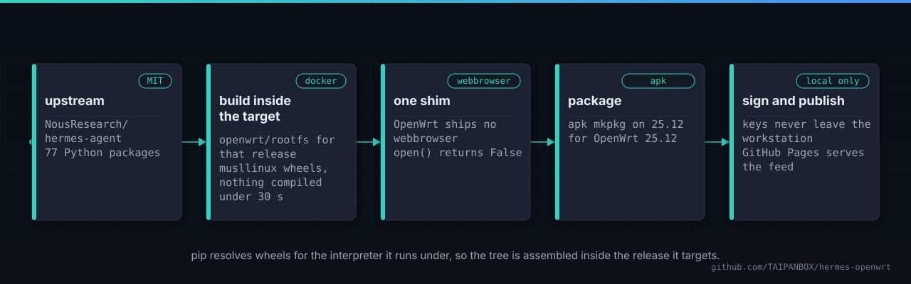

<div align="center">

# hermes-openwrt

**[Hermes Agent](https://github.com/NousResearch/hermes-agent) as a native OpenWrt service.**
Not Docker. Not a chroot. An `apk` or an `ipk` that installs into a private site-packages
and runs under procd.

[](https://github.com/TAIPANBOX/hermes-openwrt/actions/workflows/ci.yml)


</div>



## The fact everything here rests on

One thing had to be measured rather than assumed, because it decides between a native
package and a 950 MB container image:

> **pip on OpenWrt resolves musllinux wheels, and every wheel Hermes needs exists.**

On `openwrt/rootfs:aarch64_generic-25.12.4`, `pip debug --verbose` reports
`cp313-cp313-musllinux_1_2_aarch64` as its top tag. A `pydantic-core` wheel, which is
compiled Rust, installs and imports and validates. The router profile is 69 packages in
22 seconds with nothing compiled and no toolchain present. On 24.10 the same holds with
`cp311`.

So Hermes does not need to be built for OpenWrt. It needs to be assembled for it, and
that is what this repository does.

## Install

### OpenWrt 25.12 and later (apk)

```sh
wget -O /etc/apk/keys/hermes-openwrt.pem \
  https://taipanbox.github.io/hermes-openwrt/hermes-openwrt.pem

echo "https://taipanbox.github.io/hermes-openwrt/25.12/$(cat /etc/apk/arch)/packages.adb" \
  >> /etc/apk/repositories.d/customfeeds.list

apk update && apk add hermes-agent luci-app-hermes

# and, to reach it from a phone:
apk add hermes-agent-telegram
```

### OpenWrt 24.10 (opkg)

```sh
ARCH=aarch64_cortex-a53          # GL.iNet Flint 2 and other Cortex-A53 routers
# ARCH=x86_64                    # x86 boxes
# ARCH=aarch64_generic           # other 64-bit ARM

wget -O /tmp/hermes.pub https://taipanbox.github.io/hermes-openwrt/hermes-openwrt.usign.pub
opkg-key add /tmp/hermes.pub

echo "src/gz hermes https://taipanbox.github.io/hermes-openwrt/24.10/$ARCH" \
  >> /etc/opkg/customfeeds.conf

opkg update && opkg install hermes-agent luci-app-hermes

# and, to reach it from a phone:
opkg install hermes-agent-telegram
```

No `--allow-untrusted` and no `--force` anywhere. That is the point of signing the feed.

## The web interface

`luci-app-hermes` adds **Services -> Hermes Agent**.


Six facts on one screen, because a router page is opened in two situations only: setting
the thing up, and finding out why it stopped. Free space is on that list deliberately.
Sessions and memory are a SQLite database that only grows, and a router that fills its
overlay stops routing.


The API key field reads `stored` and never a key. That is not a nicety, it is the design,
and the screenshot above is the proof of it: a picture of this page cannot leak a key,
because the page was never sent one.

## Keys go in and do not come out



A key put in UCI is world-readable, printed in full by `uci show`, and present in every
support bundle. So keys live in root-only files under `/etc/hermes-agent`, and the fields
are write-only: the page can store one and can ask whether one exists, and no method
returns one.

`scripts/gate-luci.sh` asserts that rather than trusting it. It writes a canary through
the RPC and then requires that no readable method mentions it.

## Reaching it from a phone



```sh
apk add hermes-agent-telegram          # 25.12 and later
opkg install hermes-agent-telegram     # 24.10
```

Then, in **Services -> Hermes Agent -> Settings**, switch Telegram on, paste the token
from [@BotFather](https://t.me/BotFather), and add your own numeric Telegram id. The
service will not start until that last part is done, and the reason is the next section.

**The router opens no port.** The adapter polls Telegram outbound, so this works behind
NAT, behind CGNAT, and on a connection with no static address, and nothing has to be
forwarded to the router. Webhook mode exists and its server is packaged, because a router
is the one machine in the house that plausibly does have a public address, but it is not
the default and nothing needs it.

### Why the service refuses to start with an empty allowlist

Upstream already default-denies: an unlisted user is ignored, and that is the last line
of `_is_user_authorized` in `gateway/authz_mixin.py`. So an empty allowlist is safe. It
is also silent, and silence is the problem. The bot answers nobody, explains nothing, and
the obvious next move for somebody trying to make it work is to find the switch that
turns the allowlist off.

So the service refuses to start instead, names the command that adds an id, and mentions
the switch rather than leaving it to be discovered:

```
hermes-agent: telegram is enabled but no user is allowed to talk to it.
hermes-agent: add your numeric Telegram id (ask @userinfobot for it):
hermes-agent:   uci add_list hermes.telegram.allow_user_id=123456789
hermes-agent:   uci commit hermes && service hermes-agent restart
hermes-agent: or set hermes.telegram.allow_all=1 to answer anyone, which on a
hermes-agent: bot holding router tools means anyone who finds the bot.
```

The token is handled exactly like the model API key: a root-only file, never UCI, never
argv, and a write-only field on the settings page.

### Why it is a separate package

The Telegram adapter is already inside `hermes-agent`. Upstream's wheel ships
`plugins/platforms/telegram/` alongside twenty other platforms, so nothing had to be
ported. What is missing from a router is the client library, and that is all this
package is.

Measured on 2026-09-08 inside `openwrt/rootfs` for aarch64, on both 25.12.4 (CPython
3.13) and 24.10.8 (CPython 3.11): adding `python-telegram-bot[webhooks]` to the router
profile adds **two** distributions and changes the version of nothing already installed.

| | |
|---|---|
| added | `python-telegram-bot` 22.6, `tornado` 6.5.8 |
| version changes to the base package's 69 | none |
| installed size | 9.3 MB, against the base package's 193 MB |

That second row is what makes an add-on possible at all. Two OpenWrt packages cannot own
one file: apk refuses such an install and opkg silently accepts it, then breaks the base
package when the add-on is later removed. So the contents are not written down anywhere.
`package/hermes-agent-telegram/files/delta.py` resolves the base profile and the base
profile plus Telegram on every build and subtracts, and it stops the build if a shared
package would have to change version. Upstream's pin is read from upstream's own
metadata, so a version bump carries the right one automatically.

Taking upstream's `messaging` extra whole would also have installed Discord with voice
support, which pulls compiled crypto, and Slack. The router was asked for Telegram.

## The signed feed



|  | 25.12 | 24.10 |
|---|---|---|
| index | `packages.adb`, binary | `Packages` + `Packages.gz`, text |
| signed with | `apk adbsign`, EC prime256v1 | `usign`, Ed25519 |
| signature | inside the index | a separate `Packages.sig` |
| trusted keys | `/etc/apk/keys/<name>.pem` | `/etc/opkg/keys/<fingerprint>` |
| what is signed | every package **and** the index | the index only |

Neither key works for the other line. The last row is the one worth knowing: on 24.10 a
package is trusted because its SHA256 appears in a signed index, so an `.ipk` handed over
on its own is never verifiable and `opkg install ./file.ipk` checks nothing at all.

Both refuse an untrusted feed, and only one says so out loud. apk drops the repository in
silence, so the package merely appears not to exist and the available count is two lower.
opkg prints `Signature check failed` and stops.

**Signing happens on a workstation, not in CI.** A key held as a repository secret is
readable by anyone who can push a workflow to the default branch, and this one cannot be
revoked: a router that has trusted the public half keeps trusting anything signed with the
private half until a person logs in and deletes the file. So CI builds and gates, and
`scripts/publish-feed.sh` signs and publishes from the machine where the key lives.

## How a package is built



```sh
# 25.12: apk, Python 3.13. EXTRA_ARCHES relabels the same tree for the Flint 2.
EXTRA_ARCHES=aarch64_cortex-a53 ./package/hermes-agent/build-in-container.sh aarch64_generic

# 24.10: opkg, Python 3.11
RELEASE=24.10.8 ./package/hermes-agent/build-in-container.sh x86_64
```

Docker is required; the OpenWrt SDK is not. The build runs **inside** the OpenWrt release
it targets, so the libc resolving the wheels is the one the router has. Cross-downloading
with `pip --platform` looks simpler and does not work: `pydantic-core` ships stable-ABI
wheels tagged `cp39-abi3`, and pinning `--implementation cp --python-version 3.13` narrows
the tag set until pip reports no matching distribution for a wheel that plainly exists.
`build.sh` refuses to run on a glibc interpreter rather than produce a package that would
only fail on the device.

### The one shim

OpenWrt splits the standard library into packages and ships no `webbrowser` at all, the
same way it ships no `tkinter`. Without it the CLI cannot print its own version. The shim
implements the real contract rather than a stub: `open()` returns `False`, which is the
honest answer on a machine with no screen and the one upstream's own headless path
expects, and the URL is logged so a pairing step is still completable by hand.

Everything else Hermes needs is already packaged by OpenWrt: sqlite3, ssl, ctypes,
asyncio, multiprocessing, email, http, xml, decimal, curses, readline.

## What it will not do

**It will not run a language model on the router.** The model lives elsewhere and the
router talks to it over the network. A local model here is not slow, it is unusable: the
agent's own system prompt is thousands of tokens, and a router CPU spends minutes reading
it before answering a word. Cortex-A53 in particular is ARMv8.0 with neither dotprod nor
i8mm, exactly the case llama.cpp has no fast path for.

**It will not fit a small router.** 193 MB installed rules out anything without real
storage, and the gateway wants about 175 MB of RAM before it does any work. Below 1 GB,
run [openwrt-mcp](https://github.com/GlassOnTin/openwrt-mcp) on the router instead and
keep Hermes on a machine with room. That is the better shape anyway: the router becomes a
narrow, audited tool provider rather than the host of a Python runtime.

**Browser, vision, image generation and the wake-word stack are not packaged.** They pull
heavy dependencies for capabilities a headless router does not have. `ffmpeg` is included,
because voice messages and speech transcoding do work here and are cheap.

## Letting it touch the router

The recommended answer is not a root shell. Run
[openwrt-mcp](https://github.com/GlassOnTin/openwrt-mcp) alongside it and grant a narrow,
audited, expiring window over ubus:

```sh
openwrt-mcp pair hermes > /etc/hermes-agent/router-mcp.token
chmod 600 /etc/hermes-agent/router-mcp.token
openwrt-mcp allow hermes ubus_call,logread 'network.* iwinfo.* system.*' 30d
```

Every call is then policy-checked and written to an audit log, ungranted tools are refused
by name, and configuration changes carry a rollback timer. Read-only first is worth the
ten minutes.

## What is checked, and how

Nothing here is verified by reading the archive. Every gate installs the package into
OpenWrt's own published rootfs and then asks the running system.

| gate | what it proves |
|---|---|
| `gate-package.sh` | 9 checks: apk installs it, the CLI runs, it ships disabled, it refuses without a key, the key reaches neither argv nor UCI, config survives reinstall, removal is clean |
| `gate-ipk.sh` | 6 checks on 24.10: opkg installs it, it runs on Python 3.11, `/etc/config/hermes` is a registered conffile, removal leaves nothing |
| `gate-luci.sh` | 10 checks: files land where luci-base looks, both views parse, menu and ACL are valid JSON, the rpcd backend answers on ubus, a written key lands 0600, the page can tell a missing package from a missing token, and **no method returns a key** |
| `gate-feed.sh` | 3 checks: refused without the key, installs with it, no `--allow-untrusted` needed |
| `gate-feed-opkg.sh` | 3 checks: `Signature check failed` without the key, `passed` with it, and installs |
| `gate-telegram.sh` | 8 checks: the base alone cannot import telegram, the add-on installs beside it, neither package claims a file the other owns, the library imports, and the service refuses in each of the three ways a Telegram setup can be incomplete |
| `gate-telegram-opkg.sh` | 5 checks on 24.10, where opkg does not refuse a collision but overwrites: the file lists are compared directly, and removing the add-on must leave all 9037 base files |
| `gate-scenarios-bound.sh` | every scenario in `features/` names a check that runs, and every check is described by a scenario |
| `teeth.sh` | plants three faults and requires a different check to catch each one |
| `teeth-telegram.sh` | four more: a colliding file, a missing library, and two refusals cut out of the init script |

`teeth.sh` earns its place. Its first run found a real defect in this repository rather
than in the harness: a package built with one `.pyc` missing writes that bytecode at
runtime into its own installed directory, apk does not own the file, and `apk del` then
leaves all 193 MB behind.

## Status

- [x] Native package for 25.12 (apk) and 24.10 (opkg)
- [x] `aarch64_cortex-a53` for the Flint 2, plus `x86_64` and `aarch64_generic`
- [x] LuCI interface with write-only key handling
- [x] Signed feed for both lines, signed on a workstation
- [x] Every gate runs on OpenWrt's own rootfs images in CI
- [ ] **Run on real hardware.** No router has run this yet, only the published images
- [x] Telegram, as a two-distribution add-on package, on both release lines
- [ ] Track upstream releases automatically, which arrive every two to four days

## Prior art, and what is not ours

[`Dedrimer/hermes-openwrt`](https://github.com/Dedrimer/hermes-openwrt) is an independent
native port that arrived at the same `webbrowser` shim from the same wall. It carries no
licence file, so no code from it is used here; the overlap is two people meeting the same
constraint.

[`GlassOnTin/openwrt-mcp`](https://github.com/GlassOnTin/openwrt-mcp) is the router-side
MCP server this pairs with, and its apk packaging for OpenWrt 25.12 came from
[a pull request out of this work](https://github.com/GlassOnTin/openwrt-mcp/pull/1).

Hermes Agent is Nous Research's and is MIT licensed. This repository is not affiliated
with them; the packaging is what is new here, and it is MIT too.
