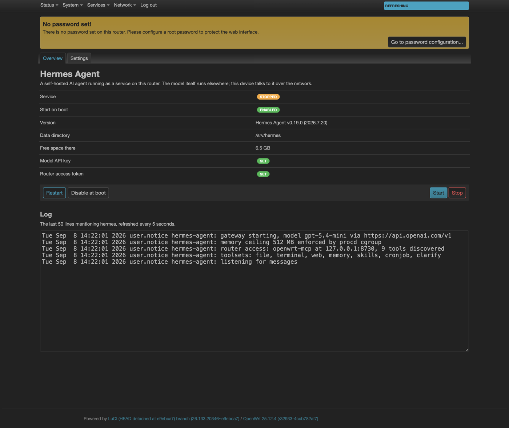
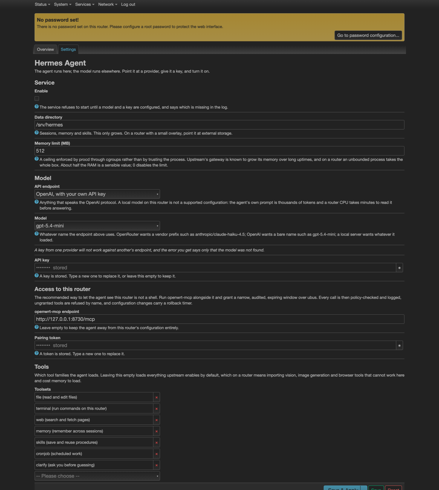

# hermes-openwrt

[Hermes Agent](https://github.com/NousResearch/hermes-agent) as a native OpenWrt package.
Not Docker, not a chroot: an `.apk` that installs into a private site-packages, runs under
procd, and is configured through UCI like anything else on the router.

```sh
apk add --allow-untrusted ./hermes-agent-0.19.0-r1.apk
```

## The fact this rests on

Everything here follows from one thing that had to be measured rather than assumed,
because it decides between a native package and a 950 MB container image:

**pip on OpenWrt 25.12 resolves musllinux wheels, and every wheel Hermes needs exists.**

On `openwrt/rootfs:aarch64_generic-25.12.4`, `pip debug --verbose` reports
`cp313-cp313-musllinux_1_2_aarch64` as its top tag. A `pydantic-core` wheel, which is
compiled Rust, installs and imports and validates. The whole router profile is 69
packages in 22 seconds with nothing compiled and no toolchain present.

So Hermes does not need to be built for OpenWrt. It needs to be assembled for it, and
that is what this repository does.

## What you get

| | |
|---|---|
| Package | 56 MB compressed, 193 MB installed |
| Pulled from the release feed | `python3`, `python3-pip`, `ca-bundle`, `ffmpeg`, `ffprobe`, `ripgrep` |
| Service | procd, `S95hermes-agent`, disabled until configured |
| Configuration | `/etc/config/hermes`, a conffile that survives upgrade |
| Secrets | root-only files under `/etc/hermes-agent`, never in UCI, never in argv |
| Reference device | **GL.iNet Flint 2** (GL-MT6000): 4 x Cortex-A53, 1 GB RAM, 8 GB eMMC |
| Architectures | `aarch64_cortex-a53` (Flint 2), `x86_64`, `aarch64_generic` |
| Releases | 25.12 (Python 3.13). 24.10 (Python 3.11) is a build-time switch, untested |

## What it will not do

**It will not run a language model on the router.** The model lives elsewhere and the
router talks to it over the network. Point `base_url` at a cloud endpoint, at your own
gateway, or at a machine on your LAN running llama-server or Ollama. A local model on the
router itself is not slow, it is unusable: the agent's own system prompt is thousands of
tokens, and a router CPU spends minutes reading it before answering a word. Cortex-A53 in
particular is ARMv8.0 with neither dotprod nor i8mm, which is exactly the case llama.cpp
has no fast path for.

**It will not fit a small router.** 193 MB installed rules out anything without real
storage, and the gateway wants about 175 MB of RAM before it does any work. Below 1 GB,
run [openwrt-mcp](https://github.com/GlassOnTin/openwrt-mcp) on the router instead and
keep Hermes on a machine that has room. That is the better shape anyway: the router
becomes a narrow, audited tool provider rather than the host of a Python runtime.

**Browser, vision, image generation and the wake-word stack are not packaged.** They pull
heavy dependencies for capabilities a headless router does not have. `ffmpeg` is included
because voice messages and speech transcoding do work here and are cheap.

## The web interface

`luci-app-hermes` adds **Services -> Hermes Agent** with two pages: status, service
control and a live log tail on one, and configuration on the other.



Everything worth knowing on one screen. Free space is there on purpose: sessions and
memory are a SQLite database that only grows, and a router that fills its overlay stops
routing. Both screenshots come from OpenWrt 25.12.4 with the package installed and the
data directory sized to a Flint 2's eMMC, so the numbers are the ones that device shows
rather than a workstation's.



The API key field reads `stored` and never the key. That is the whole design, and the
screenshot above is the proof of it: a picture of the settings page cannot leak a key,
because the page was never sent one.

```sh
apk add --allow-untrusted ./luci-app-hermes-0.19.0-r1.apk
```

Keys are handled write-only, and that shape is enforced by a test rather than intended.
The page can put a key in and can ask whether one is present; nothing returns a key. So
no screenshot of the settings page contains a key, no browser devtools session holds one,
and a support bundle taken from the browser cannot carry one out. The cost is that a key
cannot be checked by looking at it, which is the trade every password field makes.

The pages talk to a small rpcd backend at `/usr/libexec/rpcd/hermes` with three methods:
`status`, `logs` and `set_secret`. Only fixed names map to files, so neither a typo nor a
crafted call can write outside `/etc/hermes-agent`, and the file is created 0600 before a
byte of the key is written rather than chmod-ed afterwards.

## Installing from the signed feed

```sh
wget -O /etc/apk/keys/hermes-openwrt.pem \
  https://taipanbox.github.io/hermes-openwrt/hermes-openwrt.pem

echo "https://taipanbox.github.io/hermes-openwrt/25.12/$(cat /etc/apk/arch)/packages.adb" \
  >> /etc/apk/repositories.d/customfeeds.list

apk update && apk add hermes-agent luci-app-hermes
```

No `--allow-untrusted` anywhere, which is the point of signing. Without that key the
feed's packages are not merely refused, they are invisible: `apk add hermes-agent`
answers "no such package" and the available count is two lower. With it, both install
and verify.

The packages and the index are both signed with an EC prime256v1 key, the same shape
OpenWrt uses for its own releases. The private half never enters this repository.

## Configuring it

The package ships disabled with no key and no model, and the init script refuses to start
rather than flap: every refusal names the single thing to fix.

```sh
# the model endpoint and the model
uci set hermes.main.base_url='https://openrouter.ai/api/v1'
uci set hermes.main.model='anthropic/claude-haiku-4.5'

# the key, in a root-only file rather than in UCI
printf '%s' 'sk-...' > /etc/hermes-agent/provider.key
chmod 600 /etc/hermes-agent/provider.key

# somewhere with room; sessions and memory only grow
uci set hermes.main.data_dir='/mnt/sda1/hermes'

uci set hermes.main.enabled=1 && uci commit hermes
service hermes-agent restart
logread -f | grep hermes
```

### Letting it touch the router

The recommended answer is not a root shell. Run
[openwrt-mcp](https://github.com/GlassOnTin/openwrt-mcp) alongside it and grant a narrow,
audited, expiring window over ubus:

```sh
openwrt-mcp pair hermes > /etc/hermes-agent/router-mcp.token
chmod 600 /etc/hermes-agent/router-mcp.token
openwrt-mcp allow hermes ubus_call,logread 'network.* iwinfo.* system.*' 30d
```

Every call is then policy-checked and written to an audit log, ungranted tools are
refused by name, and configuration changes come with a rollback timer. Read-only first is
worth the ten minutes.

## Building

The build runs inside the OpenWrt release it targets, so the libc resolving the wheels is
the one the router has. Docker is required; the OpenWrt SDK is not.

```sh
./package/hermes-agent/build-in-container.sh aarch64_generic
```

Cross-downloading with `pip --platform` looks simpler and does not work: `pydantic-core`
ships stable-ABI wheels tagged `cp39-abi3`, and pinning `--implementation cp
--python-version 3.13` narrows the tag set until pip reports no matching distribution for
a wheel that plainly exists. `build.sh` refuses to run on a glibc interpreter rather than
produce a package that would only fail on the device.

### The one shim

OpenWrt splits the standard library into apk packages and ships no `webbrowser` at all,
the same way it ships no `tkinter`. Without it the CLI cannot print its own version. The
shim implements the real contract rather than a stub: `open()` returns `False`, which is
the honest answer on a machine with no screen and the one upstream's own headless path
expects, and the URL is logged so a pairing step is still completable by hand.

Everything else Hermes needs is packaged by OpenWrt already: sqlite3, ssl, ctypes,
asyncio, multiprocessing, email, http, xml, decimal, curses, readline.

## Prior art

[`Dedrimer/hermes-openwrt`](https://github.com/Dedrimer/hermes-openwrt) is an independent
native port with a LuCI interface, and it arrived at the same `webbrowser` shim from the
same wall. It carries no licence file, so no code from it is used here; the overlap is two
people meeting the same constraint, and it is worth reading if you want a second opinion
on the same problem.

This package is not affiliated with Nous Research. Hermes Agent is theirs and is MIT
licensed; the packaging here is what is new.

## Status

Proven on `openwrt/rootfs:aarch64_generic-25.12.4` in CI: the package installs, its
dependencies resolve from the real release feed, the service is enabled by post-install,
`hermes --version` runs, the gateway starts, `data_dir` is created 0700, and the API key
appears in neither argv nor UCI. The web interface has its own nine: the files land where
luci-base looks, both views parse, the menu and ACL are valid JSON, the rpcd backend
appears on ubus and answers, a key written through it lands 0600 with whitespace trimmed,
no method returns it, and removing the web app does not delete the agent's key.

Not proven for the web interface: the rendered page. Standing LuCI up inside a bare
rootfs container needs a session, a theme and a ubus session object, which would test the
container far more than the app. What is checked is everything the browser depends on.

Not proven: aarch64 hardware. No router has run this yet, only the published rootfs image.
If you put it on a real device, an issue saying what happened is worth more than a star.
