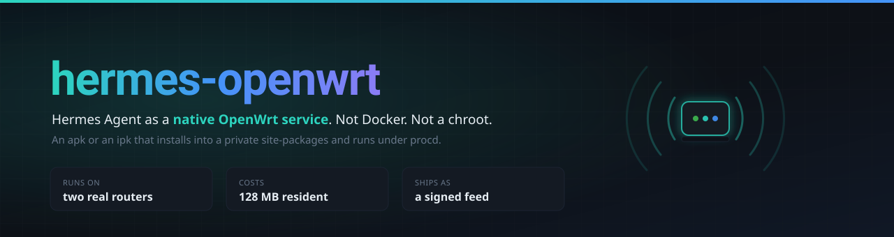
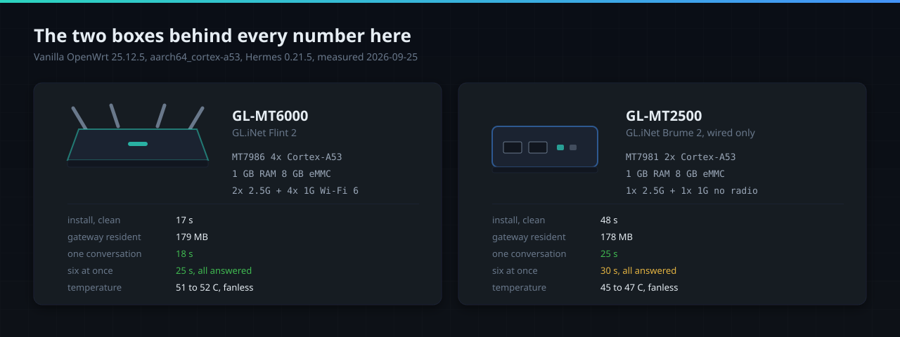
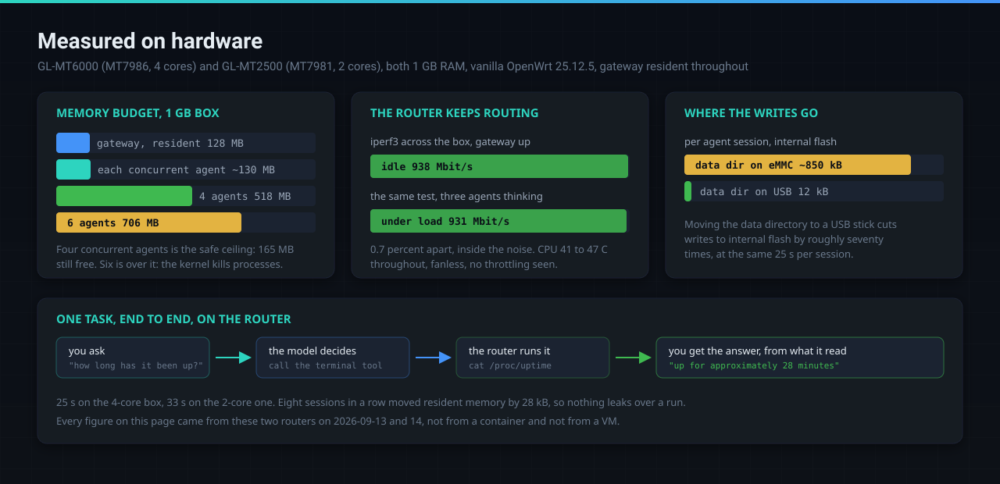
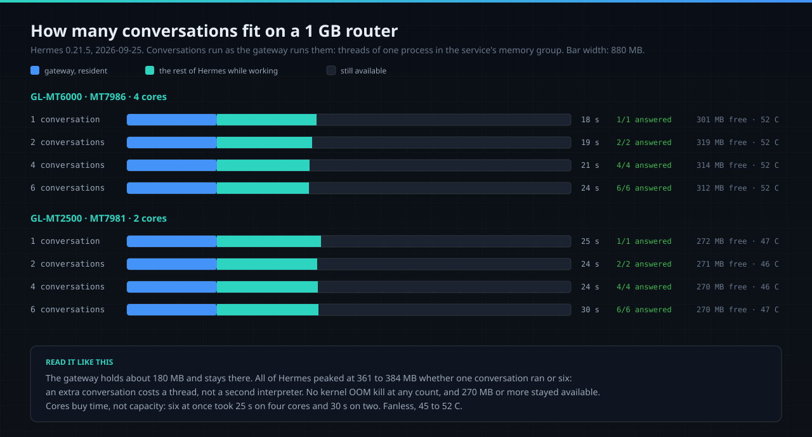
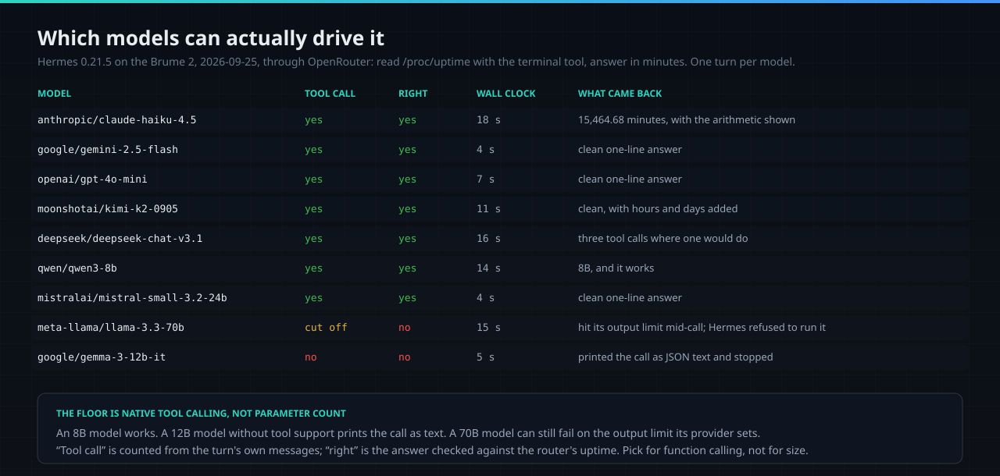
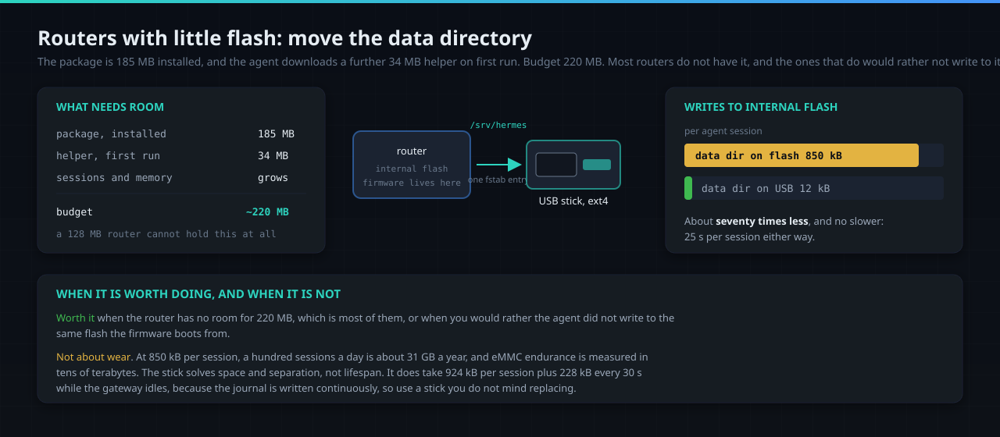

<div align="center">



# hermes-openwrt

[**Hermes Agent**](https://github.com/NousResearch/hermes-agent) packaged for the router
it runs on: an `apk` for OpenWrt 25.12 and an `ipk` for 24.10, a signed feed, a LuCI page,
and figures measured on hardware rather than in a container.

[](https://github.com/TAIPANBOX/hermes-openwrt/actions/workflows/ci.yml)


</div>


## The fact everything here rests on

One thing had to be measured rather than assumed, because it decides between a native
package and a 950 MB container image:

> **pip on OpenWrt resolves musllinux wheels, and every wheel Hermes needs exists.**

On `openwrt/rootfs:aarch64_generic-25.12.4`, `pip debug --verbose` reports
`cp313-cp313-musllinux_1_2_aarch64` as its top tag. A `pydantic-core` wheel, which is
compiled Rust, installs and imports and validates. The router profile is 69 packages in
22 seconds with nothing compiled and no toolchain present. On 24.10 the same holds with
`cp311`.

So Hermes does not need to be built for OpenWrt. It needs to be assembled for it, and
that is what this repository does.

## Install

### OpenWrt 25.12 and later (apk)

```sh
wget -O /etc/apk/keys/hermes-openwrt.pem \
  https://taipanbox.github.io/hermes-openwrt/hermes-openwrt.pem

echo "https://taipanbox.github.io/hermes-openwrt/25.12/$(cat /etc/apk/arch)/packages.adb" \
  >> /etc/apk/repositories.d/customfeeds.list

apk update && apk add hermes-agent luci-app-hermes

# and, to reach it from a phone:
apk add hermes-agent-telegram
```

### OpenWrt 24.10 (opkg)

```sh
ARCH=aarch64_cortex-a53          # GL.iNet Flint 2, Brume 2 and other Cortex-A53 routers
# ARCH=aarch64_generic           # other 64-bit ARM

wget -O /tmp/hermes.pub https://taipanbox.github.io/hermes-openwrt/hermes-openwrt.usign.pub
opkg-key add /tmp/hermes.pub

echo "src/gz hermes https://taipanbox.github.io/hermes-openwrt/24.10/$ARCH" \
  >> /etc/opkg/customfeeds.conf

opkg update && opkg install hermes-agent luci-app-hermes

# and, to reach it from a phone:
opkg install hermes-agent-telegram

# optional on 24.10, where the feed carries it: faster file search
opkg install ripgrep
```

On 24.10 the package does not declare `ripgrep`. OpenWrt's 24.10.8 index has not carried
it for `aarch64_generic` or `x86_64` since its rebuilds of 2026-09-23 and 24, and a
declared dependency the feed lacks blocks the whole install. Without it Hermes searches
file contents with `grep`.

No `--allow-untrusted` and no `--force` anywhere. That is the point of signing the feed.

## Measured on hardware

Those four lines install it. This section is what happened when they were run on actual
routers rather than in CI, which until 2026-09-13 had never been done: everything the
repository claimed was true of container images. Two boxes changed that, and every figure
below comes from them.



Both are GL.iNet hardware running **vanilla OpenWrt 25.12.5**, not the vendor firmware
they ship with: the stock image was replaced entirely, over the network, and the package
was installed from the signed feed exactly as the instructions above describe. They are
the two routers this package is tested on, chosen as two form factors doing the same job:
the Flint 2 is a Wi-Fi 6 router with four cores and six ports, and the Brume 2 is a
wired-only gateway with two cores, closer to what a small always-on box looks like.

| | GL-MT6000 (Flint 2) | GL-MT2500 (Brume 2) |
|---|---|---|
| SoC | MT7986, 4x Cortex-A53 | MT7981, 2x Cortex-A53 |
| RAM / free flash | 1 GB / 6.8 GB | 1 GB / 6.8 GB |
| `apk add hermes-agent luci-app-hermes` | 16 s | 48 s |
| installed tree | 185 MB | 185 MB |
| `hermes --version`, cold | 3 s | 4 s |
| gateway resident | 128 MB | 131 MB |
| one agent task, end to end | 25 s | 33 s |
| four concurrent agents | 32 s, all finished | 62 s, all finished |
| six concurrent agents | 57 s, **3 OOM kills** | 164 s, **3 OOM kills** |



### What fits alongside your other services

A box with WireGuard, Tailscale and the usual packages still has to run all of them, so
the number that matters is what Hermes takes while working, not while idle. Concurrency
was pushed until something broke:



In that run every agent was its own `hermes chat` process, and each one loaded all of
Hermes, about 130 MB apiece: four at once is the ceiling for that shape on a 1 GB router,
and six made the kernel kill processes three times on each box. It is not the shape a
Telegram bot uses. The gateway runs every conversation as a thread of one process, so an
extra conversation costs a few megabytes rather than a whole interpreter; the next
section measures that.

Two things that were worth checking and turned out fine. **Routing is not disturbed**:
iperf3 across the box measured 938 Mbit/s idle and 931 Mbit/s while three agents were
working, which is inside the noise. **Nothing leaks over a run**: eight sequential
sessions moved the gateway's resident memory from 108688 kB to 108716 kB, and each
session still took its usual 24 s. Temperature stayed between 41 and 47 C on the Flint 2
and between 39 and 43 C on the Brume 2, fanless, with no throttling.

### Under the router's own work

Measured on 2026-09-24, with conversations run the way the gateway runs them (threads of
one process inside the service's own cgroup), each a real diagnosis through the terminal
tool with `openai/gpt-4o-mini` on OpenRouter:

- **Flint 2, carrying a house's internet as a transparent bridge.** With one and then
  three conversations running, the house's latency to the internet stayed at a median of
  11 ms (21 ms at most, no loss), a download through the bridge from a Wi-Fi client ran at
  the same 440 to 490 Mbit/s, the kernel dropped no packets, and the four cores stayed
  about 80% idle.
- **Brume 2, carrying a WireGuard tunnel at 580 Mbit/s.** A conversation running at the
  same time took about a third of the tunnel's throughput (395 and 383 Mbit/s with one
  and three), and a quarter at nice 10 (438 Mbit/s), which is why the service runs at
  nice 10. Latency through the tunnel stayed at 4 to 5 ms throughout.
- **Memory.** Three conversations took 230 MB for all of Hermes on the Brume and 291 MB
  on the Flint; six took 258 MB on the Brume. The 512 MB ceiling never came into play.

One run per step, and how long a conversation takes is mostly the model's own time.

### Which models can actually drive it

The package is provider-agnostic, so the useful question is which models can call a tool
rather than talk about calling one. Same task on the same box, through OpenRouter:



The same runs as text, since a picture is not greppable:

| Model | Called the tool | Wall clock | Note |
|---|---|---|---|
| `anthropic/claude-haiku-4.5` | yes | 25 s | reference |
| `google/gemini-2.5-flash` | yes | 25 s | clean |
| `openai/gpt-4o-mini` | yes | 24 s | clean |
| `moonshotai/kimi-k2-0905` | yes | 25 s | clean |
| `deepseek/deepseek-chat-v3.1` | yes | 34 s | leaks its reasoning into the reply |
| `qwen/qwen3-8b` | yes | 43 s | slowest that still works |
| `mistralai/mistral-small-3.2-24b` | yes | 24 s | called the tool, then did the arithmetic wrong |
| `meta-llama/llama-3.3-70b` | no | 35 s | provider returned an empty stream |
| `google/gemma-3-12b-it` | **no** | 26 s | printed `[terminal(command=...)]` as plain text |

The floor is native tool calling, not parameter count: an 8B model works, a 12B model
without tool support does not, and a 24B model can call the tool correctly and still get
the answer wrong. Pick accordingly, and prefer a model with real function calling over a
larger one without it.

One provider note: OpenRouter and any OpenAI-compatible endpoint work. Anthropic's own
API does not, because the native provider wants the `anthropic` python package, which
this wheel set does not carry, and the OpenAI-compatible endpoint answers 401.

### Small flash: put the data directory on a USB stick

On a router that has never had Hermes, the install also brings Python, ffmpeg and ripgrep
from OpenWrt's own feed. Measured on 2026-09-25 on both routers, after removing every trace of the package
and running the lines above as written: the install took 285 MB of flash on the Brume 2
and 290 MB on the Flint 2, Telegram add-on included. The first start then downloads a
32 MB helper (`tirith`) into the data directory, 323 MB in all on the Flint 2. Sessions,
memory and a SQLite journal grow there from then on, so budget at least 325 MB plus room
to grow, not the 185 MB the package tree alone takes. On a router with 8 MB or 128 MB of
flash that does not fit, and even where it fits, the writes land on the same flash the
firmware lives on.



```sh
apk add kmod-usb-storage kmod-fs-ext4 block-mount e2fsprogs

mkfs.ext4 -F -L hermes-data /dev/sda1
mkdir -p /mnt/usb && mount /dev/sda1 /mnt/usb
/etc/init.d/hermes-agent stop
cp -a /srv/hermes/. /mnt/usb/ && umount /mnt/usb

uci set fstab.hermes=mount
uci set fstab.hermes.uuid="$(block info /dev/sda1 | grep -o 'UUID="[^"]*"' | cut -d'"' -f2)"
uci set fstab.hermes.target='/srv/hermes'
uci set fstab.hermes.options='rw,noatime'
uci set fstab.hermes.enabled='1'
uci commit fstab && /etc/init.d/fstab boot
/etc/init.d/hermes-agent start
```

### Two defects the hardware found

Neither was visible in a container or on x86, which is the whole argument for running on
the thing itself.

**`bash` is required, and was not declared.** Hermes builds its shell commands with
`builtin cd`, which BusyBox `ash` does not have, so on a stock OpenWrt image every single
command the agent ran failed with `/bin/ash: builtin: not found` and exit 126. The model
does not recover from this; it reports the environment as broken and gives up. `bash` is
now a declared dependency and the gates check for it.

**The key reached procd's service table.** The init handed it over with
`procd_set_param env`, and procd returns its whole environment to anyone who can ask
`ubus call service list`, which rpcd ACLs can extend to a LuCI session. argv and uci were
clean, which is what the older checks looked at. The key is now read by a small wrapper
at exec time, so it exists only in the process's own environment, and
`check_key_not_in_procd_env` fails the build if it ever appears in the service table
again.

### The service controls, on both routers

On 2026-09-24 the controls described under "Letting it touch the router" were checked on
real procd on both routers, with a local build of this revision installed over the release
each one had.

- The upgrade kept the router's own `/etc/config/hermes` byte for byte and put the new
  defaults beside it as `hermes.apk-new`; with no profile set, the gateway started as admin.
- procd holds the bounded respawn (3600 s, 5 s, 5 retries), and the key does not appear
  in `ubus call service list`.
- `mem_max_mb=256` reaches the kernel: `memory.max` 268435456, `memory.swap.max` 0,
  `memory.oom.group` 1.
- A model saved the way a chat's `/model ... --global` saves it, then `kill -9`: procd
  had the gateway back in 8 s on the Flint 2 and 9 s on the Brume 2, with the model,
  provider and endpoint from UCI in place again.
- `mem_max_mb=0` and a restart: `memory.max` and `memory.swap.max` read `max`, and
  `memory.oom.group` 0.
- With the key file removed and the gateway killed, procd started it five more times,
  each start was refused and logged, and procd then left the service stopped.
- From start to the gateway's own exec takes 3 to 4 s on the Flint 2 and 4 to 5 s on the
  Brume 2.

The Flint 2 carried the house's internet the whole time. A machine in the house pinged
the house router and 1.1.1.1 once a second throughout, 222 times each, lost none, and
the internet median stayed at 11 ms.

## The web interface

`luci-app-hermes` adds **Services -> Hermes Agent**: an overview with service state,
version, free space where the data lives, which keys are set and a live log tail, and a
settings page for the endpoint, the model, the keys, router access, Telegram and toolsets.

It looks like every other LuCI page, and two things about it are not cosmetic.

**The key fields are write-only.** They read `stored`, never a key: the page can store one
and can ask whether one exists, and no method returns one, which is the next section.

**The log tail is the only way to see the service without SSH**, and it is not decoration.
The worst defect this package ever shipped, a flag the CLI rejects that killed the service
at argument parsing on every start, was found by opening that box in a browser after weeks
of green gates. There is a check for it now.

## Keys go in and do not come out


A key put in UCI is world-readable, printed in full by `uci show`, and present in every
support bundle. So keys live in root-only files under `/etc/hermes-agent`, and the fields
are write-only: the page can store one and can ask whether one exists, and no method
returns one.

`scripts/gate-luci.sh` asserts that rather than trusting it. It writes a canary through
the RPC and then requires that no readable method mentions it.

The page manages the three key files in `/etc/hermes-agent`. If UCI points the service
at a different file, the page says so and does not write its own slot, and a write that
fails is reported as not saved. Read-only access to the page covers its status and log
calls and its own UCI configuration, and nothing else: not procd's service list, where a
service's environment can be read, and no file on the router.

## Reaching it from a phone


```sh
apk add hermes-agent-telegram          # 25.12 and later
opkg install hermes-agent-telegram     # 24.10
```

Then, in **Services -> Hermes Agent -> Settings**, switch Telegram on, paste the token
from [@BotFather](https://t.me/BotFather), and add your own numeric Telegram id. The
service will not start until that last part is done, and the reason is the next section.

**The router opens no port.** The adapter polls Telegram outbound, so this works behind
NAT, behind CGNAT, and on a connection with no static address, and nothing has to be
forwarded to the router. Webhook mode exists and its server is packaged, because a router
is the one machine in the house that plausibly does have a public address, but it is not
the default and nothing needs it.

### Why the service refuses to start with an empty allowlist

Upstream already default-denies: an unlisted user is ignored, and that is the last line
of `_is_user_authorized` in `gateway/authz_mixin.py`. So an empty allowlist is safe. It
is also silent, and silence is the problem. The bot answers nobody, explains nothing, and
the obvious next move for somebody trying to make it work is to find the switch that
turns the allowlist off.

So the service refuses to start instead, names the command that adds an id, and mentions
the switch rather than leaving it to be discovered:

```
hermes-agent: telegram is enabled but no user is allowed to talk to it.
hermes-agent: add your numeric Telegram id (ask @userinfobot for it):
hermes-agent:   uci add_list hermes.telegram.allow_user_id=123456789
hermes-agent:   uci commit hermes && service hermes-agent restart
hermes-agent: or set hermes.telegram.allow_all=1 to answer anyone, which on a
hermes-agent: bot holding router tools means anyone who finds the bot.
```

The token is handled exactly like the model API key: a root-only file, never UCI, never
argv, and a write-only field on the settings page.

### Why it is a separate package

The Telegram adapter is already inside `hermes-agent`. Upstream's wheel ships
`plugins/platforms/telegram/` alongside twenty other platforms, so nothing had to be
ported. What is missing from a router is the client library, and that is all this
package is.

Measured on 2026-09-08 inside `openwrt/rootfs` for aarch64, on both 25.12.4 (CPython
3.13) and 24.10.8 (CPython 3.11): adding `python-telegram-bot[webhooks]` to the router
profile adds **two** distributions and changes the version of nothing already installed.

| | |
|---|---|
| added | `python-telegram-bot` 22.6, `tornado` 6.5.8 |
| version changes to the base package's 69 | none |
| installed size | 9.3 MB, against the base package's 185 MB |

That second row is what makes an add-on possible at all. Two OpenWrt packages cannot own
one file: apk refuses such an install and opkg silently accepts it, then breaks the base
package when the add-on is later removed. So the contents are not written down anywhere.
`package/hermes-agent-telegram/files/delta.py` resolves the base profile and the base
profile plus Telegram on every build and subtracts, and it stops the build if a shared
package would have to change version. Upstream's pin is read from upstream's own
metadata, so a version bump carries the right one automatically.

Taking upstream's `messaging` extra whole would also have installed Discord with voice
support, which pulls compiled crypto, and Slack. The router was asked for Telegram.

## The signed feed


|  | 25.12 | 24.10 |
|---|---|---|
| index | `packages.adb`, binary | `Packages` + `Packages.gz`, text |
| signed with | `apk adbsign`, EC prime256v1 | `usign`, Ed25519 |
| signature | inside the index | a separate `Packages.sig` |
| trusted keys | `/etc/apk/keys/<name>.pem` | `/etc/opkg/keys/<fingerprint>` |
| what is signed | every package **and** the index | the index only |

Neither key works for the other line. The last row is the one worth knowing: on 24.10 a
package is trusted because its SHA256 appears in a signed index, so an `.ipk` handed over
on its own is never verifiable and `opkg install ./file.ipk` checks nothing at all.

Both refuse an untrusted feed, and only one says so out loud. apk drops the repository in
silence, so the package merely appears not to exist and the available count is two lower.
opkg prints `Signature check failed` and stops.

**Signing happens on a workstation, not in CI.** A key held as a repository secret is
readable by anyone who can push a workflow to the default branch, and this one cannot be
revoked: a router that has trusted the public half keeps trusting anything signed with the
private half until a person logs in and deletes the file. So CI builds and gates, and
`scripts/publish-feed.sh` signs and publishes from the machine where the key lives.

## How a package is built


```sh
# 25.12: apk, Python 3.13. EXTRA_ARCHES relabels the same tree for the Flint 2 and Brume 2.
EXTRA_ARCHES=aarch64_cortex-a53 ./package/hermes-agent/build-in-container.sh aarch64_generic

# 24.10: opkg, Python 3.11
RELEASE=24.10.8 EXTRA_ARCHES=aarch64_cortex-a53 ./package/hermes-agent/build-in-container.sh aarch64_generic
```

Docker is required; the OpenWrt SDK is not. The build runs **inside** the OpenWrt release
it targets, so the libc resolving the wheels is the one the router has. Cross-downloading
with `pip --platform` looks simpler and does not work: `pydantic-core` ships stable-ABI
wheels tagged `cp39-abi3`, and pinning `--implementation cp --python-version 3.13` narrows
the tag set until pip reports no matching distribution for a wheel that plainly exists.
`build.sh` refuses to run on a glibc interpreter rather than produce a package that would
only fail on the device.

### The one shim

OpenWrt splits the standard library into packages and ships no `webbrowser` at all, the
same way it ships no `tkinter`. Without it the CLI cannot print its own version. The shim
implements the real contract rather than a stub: `open()` returns `False`, which is the
honest answer on a machine with no screen and the one upstream's own headless path
expects, and the URL is logged so a pairing step is still completable by hand.

Everything else Hermes needs is already packaged by OpenWrt: sqlite3, ssl, ctypes,
asyncio, multiprocessing, email, http, xml, decimal, curses, readline.

## What it will not do

**It will not run a language model on the router.** The model lives elsewhere and the
router talks to it over the network. A local model here is not slow, it is unusable: the
agent's own system prompt is thousands of tokens, and a router CPU spends minutes reading
it before answering a word. Cortex-A53 in particular is ARMv8.0 with neither dotprod nor
i8mm, exactly the case llama.cpp has no fast path for.

**It will not fit a small router.** About 325 MB of flash on a new router, Python and the
first-run helper included, rules out anything without real storage, and
the gateway wants about 130 MB of RAM before it does any work. Below 1 GB,
run [openwrt-mcp](https://github.com/GlassOnTin/openwrt-mcp) on the router instead and
keep Hermes on a machine with room. That is the better shape anyway: the router becomes a
narrow, audited tool provider rather than the host of a Python runtime.

**Browser, vision, image generation and the wake-word stack are not packaged.** They pull
heavy dependencies for capabilities a headless router does not have. `ffmpeg` is included,
because voice messages and speech transcoding do work here and are cheap.

## Letting it touch the router

<!-- @codex 2026-09-19 -->
**The service runs as root.** Its default file and terminal tools can read and change
router configuration directly. Give access only to trusted operators on a spare test
router. Disabling MCP does not remove this local access.

Two profiles decide how much of that access the agent actually has. **admin** is the
default wherever the option is not set, which includes a router whose configuration
predates it, and leaves every tool the toolsets list selects in place, running as root
as described above. **assistant** turns the terminal, code execution and file tools off
regardless of what that list selects, and tells the agent so: it can still chat, keep
memory and schedule reminders, and it reaches the router only through an MCP server
such as openwrt-mcp, if one is configured, never directly. Choose it in
**Services -> Hermes Agent -> Settings -> Profile**, or from the command line:

```sh
uci set hermes.main.profile=assistant && uci commit hermes && /etc/init.d/hermes-agent restart
```

A value other than `assistant` or `admin` refuses to start rather than guess which was
meant. An upgrade leaves the router's own configuration file alone, so a router whose
file names a profile keeps it; that includes the `assistant` line the previous release
wrote into a new install. Starting the service prints which profile applies, and in
assistant the command that switches it.

One turn makes at most 20 model calls with tools (`hermes.main.max_turns`, 1 to 500),
and a turn that reaches the limit gets one more, without tools, to sum up what it found.
Upstream allows 90, and on 2026-09-24 a bot in the assistant profile, asked for something
it had no tool for, spent all 90 before it answered. The same day, with this revision on
both routers and each asked for its own uptime: in admin it ran `uptime` and answered in
two model calls; with the limit set to 1 it stopped after the first call, which had
already run `uptime`, and the summary answered from that; in assistant, told what it
cannot do, it said so at once, in one call.

The optional [openwrt-mcp](https://github.com/GlassOnTin/openwrt-mcp) connection adds
policy checks to calls sent through that server. Its policy does not constrain local
file, terminal, plugins or delegated tools. Pair once on the router and grant a narrow,
expiring window. openwrt-mcp refuses every tool it has not been granted, so a connection
without a grant does nothing:

```sh
openwrt-mcp pair hermes > /etc/hermes-agent/router-mcp.token
chmod 600 /etc/hermes-agent/router-mcp.token
openwrt-mcp allow hermes ubus_call,logread 'network.* iwinfo.* system.*' 30d
```

Then set its URL in UCI or LuCI. The package writes `mcp_servers.openwrt` into Hermes
config with an environment placeholder; the token is read at exec time and never stored
in YAML or procd's table. An `openwrt` entry of the operator's own is preserved and
startup is refused until it is renamed, unless it is identical to the entry the package
writes, which is then adopted. If the token file is missing when the gateway starts, it
starts without this connection and says so in the log. Clearing the URL removes only the
package-managed entry.

UCI also selects the primary model and OpenAI-compatible endpoint through
`model.default`, `model.base_url` and `model.provider` in Hermes config. They are
written again before every start, including the restarts procd makes on its own, so a
model switched from a chat lasts until the next start. Credentials remain environment
references. Conflicting `.env`, named provider, credential pool
or Authorization-header settings refuse startup; existing credentials are preserved
for the operator to reconcile. Explicit job/channel overrides and fallback chains
retain their upstream behavior.

The UCI tool list sets `platform_toolsets.telegram` and `platform_toolsets.cron`.
Empty means no selected default families. Upstream per-job tool overrides and
separately configured plugins or MCP servers still apply. This selection is not an
OS sandbox. Invalid YAML or tool names stop startup instead of loading a broader set.

`mem_max_mb` requires writable **cgroup v2 memory control**. Before every launch,
the wrapper verifies its dedicated procd cgroup, applies `memory.max`, disables swap
for that group and enables group OOM termination. Unsupported firmware refuses to
start with an explanation. Setting `mem_max_mb=0` explicitly accepts an unlimited
process and lifts a ceiling an earlier start applied. This ceiling protects against
accidental memory growth; root tools can modify system controls. Verify the controller
on the target router before testing.

procd retries a gateway that fails at start at most five times within an hour and then
leaves it stopped, so a refusal is logged a handful of times rather than every five
seconds. It also runs the service at nice 10, so the router's own work keeps the
processor; "Under the router's own work" above has the measurement.

## What is checked, and how

Nothing here is verified by reading the archive. Every gate installs the package into
OpenWrt's own published rootfs and then asks the running system.

| gate | what it proves |
|---|---|
| `gate-package.sh` | 11 checks: apk installs it with every dependency including `bash`, the CLI runs, it ships disabled, it refuses without a key, **the command the init hands procd actually starts and stays up**, the key reaches neither argv nor UCI nor **procd's service table**, config survives reinstall, removal is clean |
| `gate-ipk.sh` | 6 checks on 24.10: opkg installs it, it runs on Python 3.11, `/etc/config/hermes` is a registered conffile, removal leaves nothing |
| `gate-luci.sh` | 14 checks: files land where luci-base looks, both views parse, menu and ACL are valid JSON, the rpcd backend answers on ubus and, before the first start, reports the free space where the data will go, a written key lands 0600, the page can tell a missing package from a missing token, **no method returns a key**, the read permission is exactly the page's two calls and its UCI config, a failed write is reported, and the page will not write a slot the service does not read |
| `gate-feed.sh` | 3 checks: refused without the key, installs with it, no `--allow-untrusted` needed |
| `gate-feed-opkg.sh` | 3 checks: `Signature check failed` without the key, `passed` with it, and installs |
| `gate-telegram.sh` | 8 checks: the base alone cannot import telegram, the add-on installs beside it, neither package claims a file the other owns, the library imports, and the service refuses in each of the three ways a Telegram setup can be incomplete |
| `gate-telegram-opkg.sh` | 5 checks on 24.10, where opkg does not refuse a collision but overwrites: the file lists are compared directly, and removing the add-on must leave every file owned by the base package |
| `gate-runtime.sh` | 37 tests against the installed upstream payload: actual model HTTP response, platform tool defaults, MCP configuration, credential handover, UCI re-applied after a model switched from a chat, override refusals, bounded respawn, kernel-enforced memory limits including lifting one, the two profiles and what the assistant is told, and the per-turn limit on model calls |
| `teeth-runtime.py` | 30 product mutations must fail their named test; missing subjects refuse verification and the restored product must pass |
| `gate-scenarios-bound.sh` | every scenario in `features/` names a check that runs, and every check is described by a scenario |
| `gate-named-routers.sh` | the tracked tree names no router but the two it is tested on, by name or by model number |
| `teeth.sh` | plants five faults and requires a different check to catch each one |
| `teeth-telegram.sh` | four more: a colliding file, a missing library, and two refusals cut out of the init script |
| `teeth-luci.sh` | five for the web page: procd's service list back in the read permission, a file read grant beside it, the failed-write check removed, the refusal to write a slot the service does not read removed, and the free space measured on the missing data directory again |
| `teeth-named-routers.sh` | a box named by name and one named by model number must fail, the two test routers must pass, and nothing to read must refuse |

`teeth.sh` earns its place. Its first run found a real defect in this repository rather
than in the harness: a package built with one `.pyc` missing writes that bytecode at
runtime into its own installed directory, apk does not own the file, and `apk del` then
leaves all 193 MB behind.

The newest check is there because of a worse one. The service was passing `--toolsets`
to `hermes gateway run`, which does not accept it, so it died at argument parsing on
every start with the configuration this package ships. Every gate was green: the package
installed, the CLI ran, the service refused politely without a key. Nothing had ever run
the command line the init builds. It was found by opening the web interface and reading
the log box, which is the one thing no gate here does.

Hardware added the same lesson twice more. A container has `bash`, so no gate could see
that the agent's shell tool is unusable without it; a container has no procd, so no gate
could see the key in the service table. Both now have checks, and the rule they teach is
the same one: a gate proves what it was pointed at, and a router is not a container.

## Status

- [x] Native package for 25.12 (apk) and 24.10 (opkg)
- [x] `aarch64_cortex-a53` for the Flint 2 and Brume 2, plus `aarch64_generic`
- [x] LuCI interface with write-only key handling
- [x] Signed feed for both lines, signed on a workstation
- [x] Every gate runs on OpenWrt's own rootfs images in CI
- [x] **Run on real hardware.** Two GL.iNet routers on vanilla OpenWrt 25.12.5; see the figures above
- [x] **Service controls on real procd**: bounded respawn, the memory ceiling and its removal, UCI back in place after a crash (Flint 2 and Brume 2, 25.12.5)
- [x] **A full agent turn on a router**, model calling a tool and answering from what it read
- [x] **Measured under load**: concurrency ceiling, thermals, throughput, flash writes, leak check
- [x] **The feed installs on hardware** with its signature verified and no `--allow-untrusted`
- [x] Telegram, as a two-distribution add-on package, on both release lines
- [x] Two profiles, admin by default and assistant by choice, governing terminal, code execution and file tools
- [x] A per-turn limit on model calls, set on the router
- [ ] Native Anthropic provider, which needs the `anthropic` package as a second add-on
- [ ] Track upstream releases automatically, which arrive every two to four days

## Prior art, and what is not ours

[`Dedrimer/hermes-openwrt`](https://github.com/Dedrimer/hermes-openwrt) is an independent
native port that arrived at the same `webbrowser` shim from the same wall. It carries no
licence file, so no code from it is used here; the overlap is two people meeting the same
constraint.

[`GlassOnTin/openwrt-mcp`](https://github.com/GlassOnTin/openwrt-mcp) is the router-side
MCP server this pairs with, and its apk packaging for OpenWrt 25.12 came from
[a pull request out of this work](https://github.com/GlassOnTin/openwrt-mcp/pull/1).

Hermes Agent is Nous Research's and is MIT licensed. This repository is not affiliated
with them; the packaging is what is new here, and it is MIT too.
