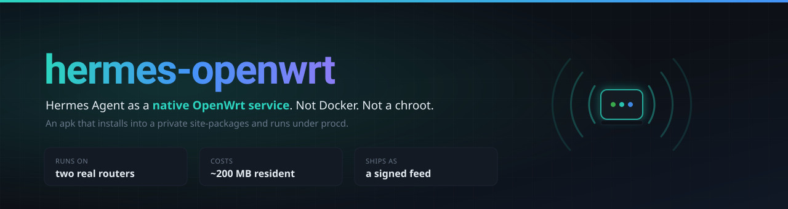
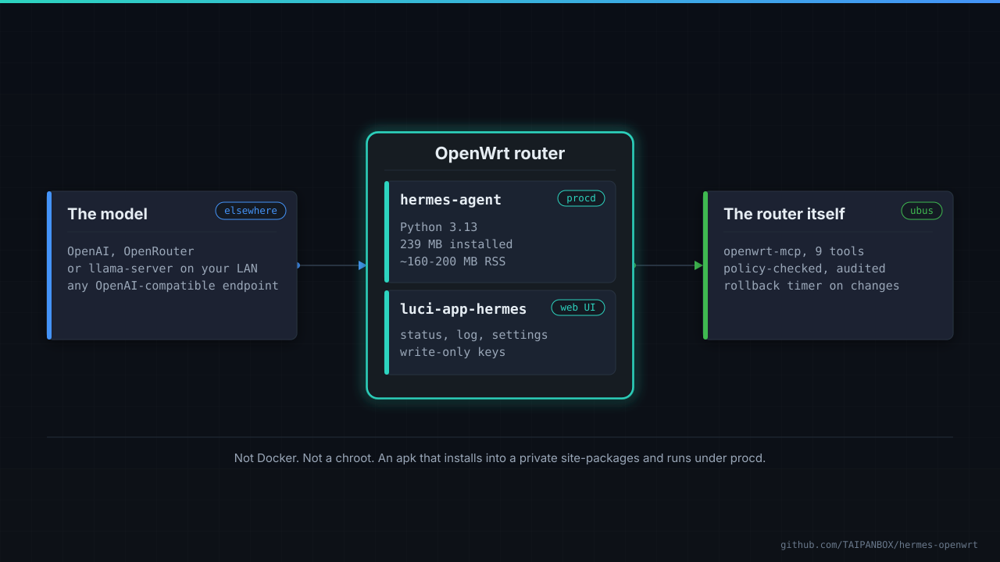
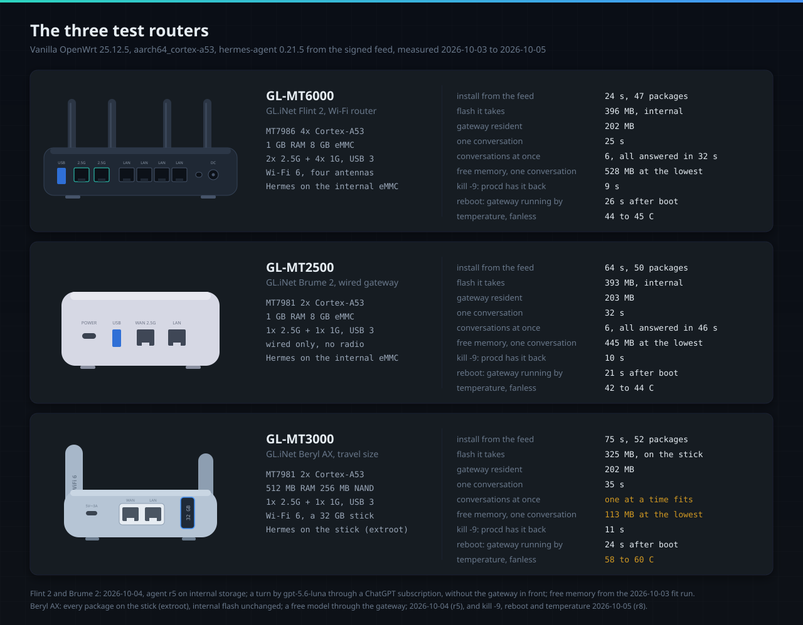
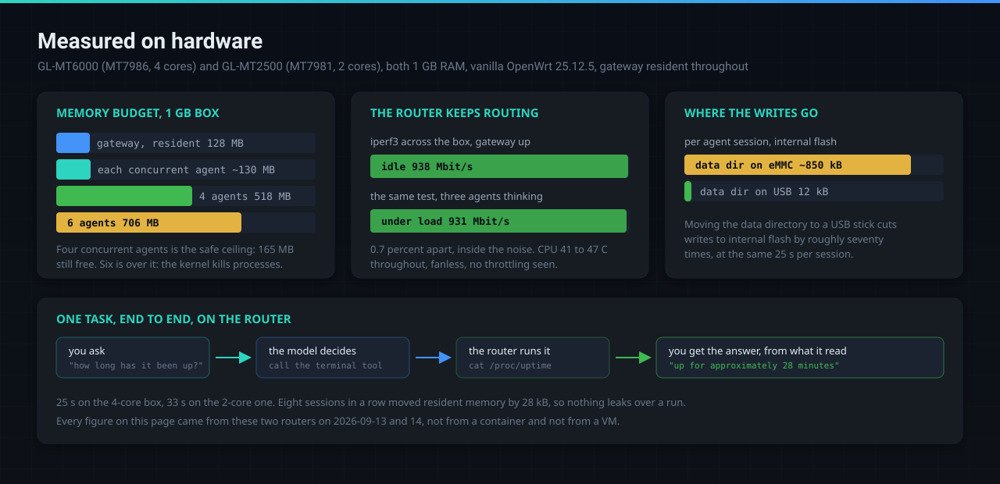
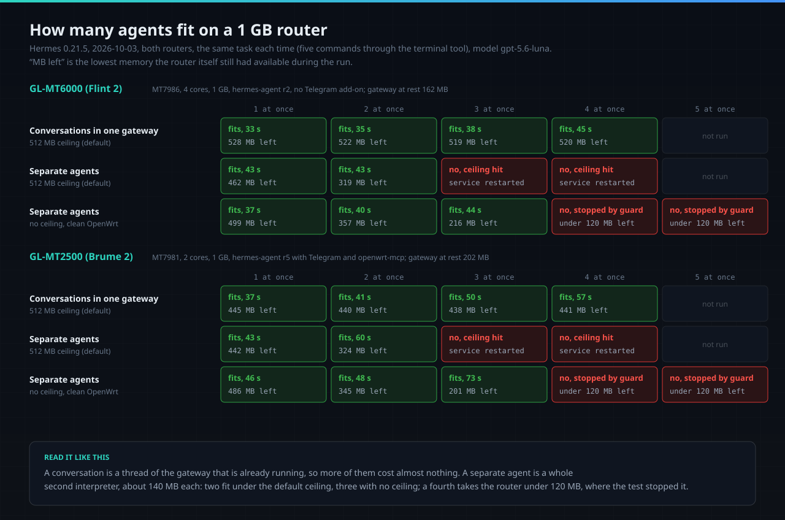
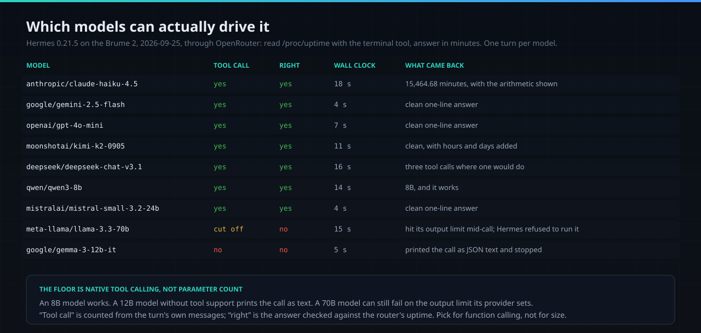
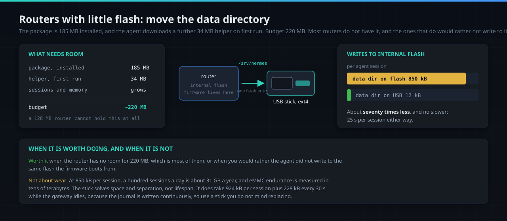
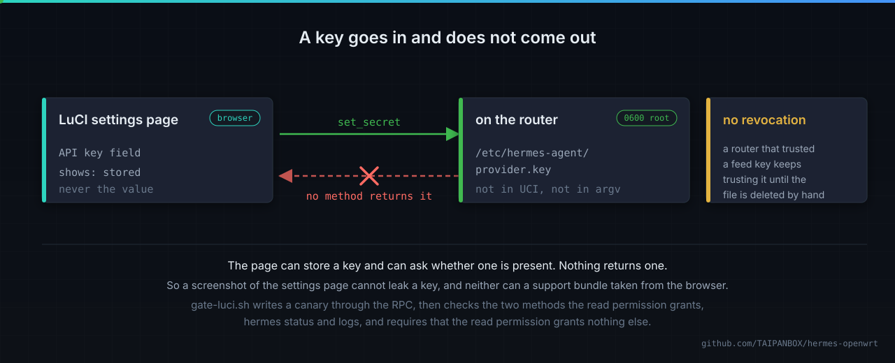
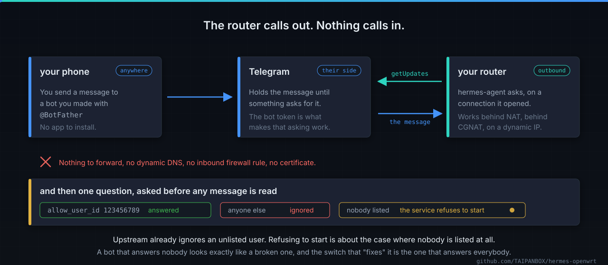
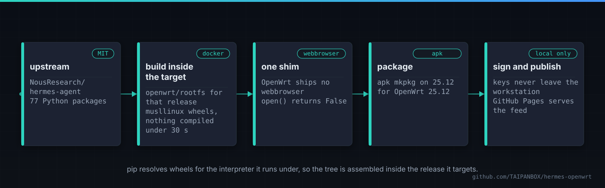

<div align="center">



# hermes-openwrt

[**Hermes Agent**](https://github.com/NousResearch/hermes-agent) packaged for the router
it runs on: an `apk` for OpenWrt 25.12, a signed feed, a LuCI page,
and figures measured on hardware rather than in a container.

[](https://github.com/TAIPANBOX/hermes-openwrt/actions/workflows/ci.yml)


</div>



## What this is, and what it is not

This is Hermes living on your router, inside your home network. It is an assistant with
a job to do there, not a general agent for the web, and it does not replace Hermes on a
VPS or a desktop.

- **It has no browser.** It cannot click through a website, sign in, book or buy, and a
  page that builds itself with JavaScript (flight prices, most shops) is out of its
  reach. Upstream asks for 2 GB of memory with browser tools, twice what these routers
  have, so browser, vision and image generation are not packaged (see [What it will not do](#what-it-will-not-do)).
- **It does reach the internet.** Hermes's web tools search and read ordinary pages
  without a browser, with no key of their own: on a Brume 2 on 2026-10-04 a free model
  called `web_search` and then `web_extract` on the page it found, and answered correctly
  in 45 s. The scripts behind a scheduled job fetch plain HTTP, which is measured too.
- **The model runs elsewhere.** The router runs the agent; a provider you choose runs
  the model, a free one included.

What it is good at is the network it sits in, and staying on all the time.

| Use | What it looks like | Status |
|---|---|---|
| **Looking after the home network, from a phone** | In Telegram: "why is the internet slow?" The agent runs commands on the router and answers from what they printed, not from general advice. | Measured on both routers: a five-command diagnosis answered in 18 to 25 s |
| **A watch that speaks only when something is wrong** | Every hour a script collects the router's numbers (loss and latency to the internet, DNS, free memory, flash, temperature) and the model reads them in one call. All normal, it stays silent; otherwise one message says what is wrong. | Ran every hour for 19 hours on a Brume 2 (2026-10-01/02), one model call per check, silent while all was normal. The one problem it saw (one ping of three lost) the model reported with Hermes's own failure marker, which a job delivering failures locally keeps silent: see [What a test chat shows](#what-a-test-chat-shows) |
| **A morning message** | At 08:00: the weather, the exchange rate and one news item found by web search, in a few lines. | Delivered at 08:00 on 2026-10-02 in one model call, though the small free model skipped the web search it was asked for. Search itself measured on 2026-10-04: the same free model, told to use it, searched and read the page |
| **An assistant that is always on** | Reminders and lists set in plain words in a chat, with no server to keep running: the router is on anyway. | Scheduling measured as above; reminders set from a chat not yet measured |

**When to choose something else.** For an agent that browses, books, or works on sites
you sign in to, run Hermes on a machine with 2 GB of memory or more; upstream's own
container image carries Chromium. The router can still serve that agent as a narrow,
audited tool provider through [openwrt-mcp](https://github.com/GlassOnTin/openwrt-mcp).

### Scheduled jobs, in practice

A job can run a script first and hand its output to the model, so a check that needs
no tools costs one model call. A job whose reply is exactly `[SILENT]` sends nothing.
Scripts live in `/srv/hermes/scripts`:

```sh
export HERMES_HOME=/srv/hermes
hermes cron create "0 * * * *" "Below is the router's hourly data. If everything is \
normal, reply with exactly [SILENT]. Otherwise say in two lines what is wrong. Do not \
call any tools." --name router-check --script router_check.sh \
  --deliver telegram:<your numeric id> --reasoning-effort none
```

Leave `--failure-deliver` out, so failures go where `--deliver` sends results. When the
model reports a problem with Hermes's own failure marker the run counts as failed, and
`--failure-deliver local` would keep that alert off your phone (see
[What a test chat shows](#what-a-test-chat-shows)).

At one call an hour that is 24 calls a day. If your provider caps free requests per
day, count the same way: one call per scripted check, a few per conversation, and
`grep -c 'API call #' /srv/hermes/logs/agent.log` shows what was actually spent.
Free models are also rate-limited by the providers behind them: on 2026-10-01 two of
three free models with tool support answered 429, and the third,
`nvidia/nemotron-3-super-120b-a12b:free`, called its tool correctly.

`hermes cron run <id>` from an SSH session runs the job in that shell, and the shell has
no Telegram token, by design: the service reads it at exec time and hands it to the
gateway only. A job delivering to Telegram is then refused with "no gateway credentials
configured". To try a job by hand, create a one-off job a few minutes ahead
(`hermes cron create 2m "..." --repeat 1 ...`), and the gateway runs it.

## The fact everything here rests on

One thing had to be measured rather than assumed, because it decides between a native
package and a 950 MB container image:

> **pip on OpenWrt resolves musllinux wheels, and every wheel Hermes needs exists.**

On `openwrt/rootfs:aarch64_generic-25.12.4`, `pip debug --verbose` reports
`cp313-cp313-musllinux_1_2_aarch64` as its top tag. A `pydantic-core` wheel, which is
compiled Rust, installs and imports and validates. For Hermes 0.21.5 the router profile
is 77 packages in under 30 seconds with nothing compiled and no toolchain present.

So Hermes does not need to be built for OpenWrt. It needs to be assembled for it, and
that is what this repository does.

### Which Hermes, and from where

The package carries **Hermes 0.21.5** (upstream tag `v2026.9.24`). PyPI stops at 0.19.0,
and upstream's own `setup.py` now refuses to build a wheel anywhere but inside its Nix
build, so the package is built the way that Nix build does it:

- from the archive of one pinned upstream commit, whose checksum is checked before a byte
  is unpacked (`package/upstream/upstream.env`);
- every library at the version upstream's `uv.lock` names at that commit, not whatever
  PyPI serves that day;
- skills, optional skills, translations and the MCP catalogue beside the wheel, under
  `/usr/share/hermes-agent`, found through the same `HERMES_BUNDLED_*` variables upstream's
  Nix wrapper sets.

Two upstream dependencies are left out, about 49 MB of an unpacked 278 MB: NVIDIA's Relay
runtime (`nemo-relay`), for which upstream falls back to a no-op host, and the HEIC/AVIF
image decoder (`pillow-heif`), which upstream imports only if it is there. Everything else
upstream depends on ships. The router records what it carries in
`/usr/lib/hermes-agent/upstream`, and `gate-upstream.sh` checks all of it.

## Install

### OpenWrt 25.12

```sh
wget -O /etc/apk/keys/hermes-openwrt.pem \
  https://taipanbox.github.io/hermes-openwrt/hermes-openwrt.pem

echo "https://taipanbox.github.io/hermes-openwrt/25.12/$(cat /etc/apk/arch)/packages.adb" \
  >> /etc/apk/repositories.d/customfeeds.list

apk update && apk add hermes-agent luci-app-hermes

# and, to reach it from a phone:
apk add hermes-agent-telegram
```

`hermes-agent` pulls in `openwrt-mcp` from the same feed (see "Letting it touch the router"),
and creates the `hermes` account the agent runs as. Upgrading from a release before
0.21.5-r3, restart the service afterwards: until then the old gateway keeps running as root.

OpenWrt 24.10 is not served: the package is built and tested for 25.12 only.

No `--allow-untrusted` and no `--force` anywhere. That is the point of signing the feed.

### Before you test

- **The router.** Vanilla OpenWrt 25.12, not a vendor firmware, on an aarch64 router:
  `cat /etc/apk/arch` has to print `aarch64_cortex-a53` or `aarch64_generic`. Nothing else
  is built. The package is tested on a Flint 2 and a Brume 2.
- **Memory.** 1 GB of RAM. The gateway alone holds about 200 MB before it does any work.
- **Flash.** About 350 MB for the packages and the Python they bring, then the data
  directory: 37 MB at the first start, growing from there. It can live on a USB stick
  (see [Small flash](#small-flash-put-the-data-directory-on-a-usb-stick)).
- **A model.** A key for an OpenAI-compatible provider, a free one included: the service
  does not start without one. A ChatGPT subscription can be added beside it and picked
  with `/model`, not used instead of it (see [More than one provider](#more-than-one-provider)).
- **A way back.** Keep a backup off the router (`sysupgrade -b /tmp/backup.tar.gz`, then
  copy it away) and know how your router's recovery mode works before you start. On
  2026-10-02 a Brume 2 under test did not come back from a reboot that followed an
  unconfirmed change: no link on any port, and two power cycles did not help. It came back
  only by flashing the vendor firmware through its U-Boot recovery page, which refused the
  OpenWrt image, and then OpenWrt again from the vendor firmware; the reflash lost the logs.
  Repeating the sequence did not reproduce it, neither in an emulated OpenWrt nor on that
  router with the next build, so the cause is not known. On 2026-10-04 the same sequence on
  that router, on the published release, came back in 33 s with the change rolled back.
  Keep your router's vendor firmware image at hand all the same.

### Removing it

```sh
/etc/init.d/hermes-agent stop
apk del luci-app-hermes hermes-agent-telegram hermes-agent openwrt-mcp
```

That removes the programs and the Python they brought. What stays is what the package made
at install and what changed while it ran: the data directory, the keys in
`/etc/hermes-agent`, `/etc/config/hermes` and `/etc/config/openwrt-mcp` once either was
changed (the owner profile rewrites the second at every start), openwrt-mcp's state in
`/etc/openwrt-mcp`, the feed's key and line, and the `hermes` account. To take all of it
away:

```sh
d=$(uci -q get hermes.main.data_dir); rm -rf "${d:-/srv/hermes}"
rm -rf /etc/hermes-agent /etc/openwrt-mcp
rm -f /etc/config/hermes /etc/config/openwrt-mcp /etc/apk/keys/hermes-openwrt.pem
sed -i '/taipanbox.github.io\/hermes-openwrt/d' /etc/apk/repositories.d/customfeeds.list
sed -i '/^hermes:/d' /etc/passwd /etc/shadow /etc/group
/etc/init.d/rpcd restart
```

If you used openwrt-mcp before this package, keep `/etc/openwrt-mcp` and its config: they
hold your other clients' pairings. The account is kept by `apk del` on purpose, so files it
owned never pass to an account created later with the same id; remove it only once its data
directory is gone, as above.

## Testing it for us

What helps most is what has not been measured yet:

1. **A reminder set in plain words in a chat**, and whether it arrives on time.
2. **The gateway's memory over days.** The longest run so far was 19 hours, and in its
   last 14.5 the gateway grew from 204 to 215 MB, too short to tell a leak from warming
   up. That figure is the gateway's own resident memory; every hour or so:
   `grep VmRSS /proc/$(pgrep -o -f 'main.py gateway')/status`.
3. **Web search with the model you use.** It works on a router (see
   [Re-run on the published release](#re-run-on-the-published-release-2026-10-04)), but
   whether a model reaches for it unasked depends on the model.
4. **Any aarch64 router other than the two above**, with its numbers.

Report what happened in an [issue](https://github.com/TAIPANBOX/hermes-openwrt/issues/new/choose):
the template asks for the router, the versions and the log. Before you paste a log, look
for keys and tokens in it; the package keeps them out of its own lines, but a model's
reply or a command's output can carry anything. A security problem goes through
[SECURITY.md](SECURITY.md) instead, not an issue.

## Measured on hardware

Every figure in this section was measured on two routers with **Hermes 0.21.5**, the
version the package carries, on 2026-09-25 unless a subsection gives its own date: not in a
container and not on a VM.



Both are GL.iNet hardware running **vanilla OpenWrt 25.12.5**, not the vendor firmware
they ship with. They are the two routers this package is tested on, chosen as two form
factors doing the same job: the Flint 2 is a Wi-Fi 6 router with four cores and six
ports, and the Brume 2 is a wired-only gateway with two cores, closer to what a small
always-on box looks like. Before each run the router was cleaned of every trace of the
package, Python and ffmpeg included, and put back exactly as it was afterwards.

| | GL-MT6000 (Flint 2) | GL-MT2500 (Brume 2) |
|---|---|---|
| SoC | MT7986, 4x Cortex-A53 | MT7981, 2x Cortex-A53 |
| RAM / free flash | 1 GB / 6.8 GB | 1 GB / 6.8 GB |
| `apk add hermes-agent luci-app-hermes`, from nothing | 17 s, 46 packages | 48 s, 45 packages |
| package tree (`/usr/lib` and `/usr/share/hermes-agent`) | 239 MB | 239 MB |
| `hermes --version`, cold | 2 s | 3 s |
| gateway resident | 179 MB | 178 MB |
| one conversation, end to end | 18 s | 25 s |
| six conversations at once | 25 s, all answered | 30 s, all answered |
| all of Hermes at six, memory | 361 MB | 379 MB |
| temperature, fanless | 51 to 52 C | 45 to 47 C |

A conversation here is a real diagnosis: the model (`openai/gpt-4o-mini` on OpenRouter)
runs five commands through the terminal tool and answers from what they printed. The
wall clock is mostly the model's own time.



### Re-run on the published release, 2026-10-04

The same two routers, cleaned of every trace of the package first, then the
[Install](#install) block above run as written against the published feed (agent 0.21.5-r5,
LuCI 0.21.5-r1, openwrt-mcp from the fork), and put back as found afterwards. The model
this time was `gpt-5.6-luna` through a ChatGPT subscription, so the conversation times are
not comparable with the table above, which used `gpt-4o-mini`.

| | Flint 2 | Brume 2 |
|---|---|---|
| the Install block, key and feed lines included | 24 s, 47 packages | 64 s, 50 packages |
| flash, agent and LuCI page / with Telegram / after the first start | 345 / 357 / 396 MB | 343 / 354 / 393 MB |
| gateway resident, 90 s after the first start | 202 MB | 203 MB |
| `kill -9` of the gateway: procd has it back | 9 s | 10 s |
| `reboot` with the service enabled: gateway running | 12 s after boot | 18 s after boot |
| one conversation, end to end | 25 s | 32 s |
| six conversations at once | 32 s, all answered | 46 s, all answered |
| all of Hermes at six (cgroup, page cache included) | 400 MB | 453 MB |
| temperature, fanless | 44 to 45 C | 42 to 44 C |

Also on the Brume 2 that day: a change made through openwrt-mcp in an unlock window and not
confirmed, then a reboot: back in 33 s, and openwrt-mcp rolled the change back at start
("unconfirmed apply ... found at startup, rolling back"). Web search with a free model
(`nvidia/nemotron-3-super-120b-a12b:free`): `web_search`, then `web_extract` on the page it
found, a correct answer in 45 s and three model calls. Through the ChatGPT subscription the
same question was answered by OpenAI's own search inside the model, with no Hermes tool
called, and the answer was out of date.

`hermes chat` run from an SSH shell has neither the model's key nor the router token: the
service hands both to the gateway only. A question to the agent from a shell is refused by
the provider (HTTP 401) and its openwrt-mcp calls by the daemon. Ask through Telegram, or
create a one-off job, which the gateway runs (see [Scheduled jobs, in practice](#scheduled-jobs-in-practice)).

### How many agents fit alongside your other services

A box with WireGuard, Tailscale and the usual packages still has to run all of them, so
the number that matters is what Hermes takes while working, not while idle. Measured on
2026-10-03 on both routers, the same task each time, with `gpt-5.6-luna` through a
ChatGPT subscription. There are two ways to run more than one agent, and they cost very
differently:



- **Conversations in one gateway**, which is how the Telegram gateway serves several
  chats: each is a thread of the process that is already running. One to four at once
  all answered, and all of Hermes stayed flat at 388 MB on the Flint 2 and 445 MB on the
  Brume 2, whose gateway also carries the Telegram add-on. The 2026-09-25 run took six
  at once with the same flat line.
- **Separate agents**, such as a second `hermes chat` or a gateway for another profile:
  each is its own Python interpreter, about 140 MB. Under the default 512 MB ceiling two
  fit. A third fills the ceiling, and since the service's memory group is ended as a
  whole, the gateway goes with it; procd started it again (27 s on the Brume 2), and the
  router kept 286 MB or more available throughout.
- **With the ceiling lifted** (`mem_max_mb=0`) on clean OpenWrt, with Tailscale and every
  other non-OpenWrt service stopped for the run: three separate agents fit, leaving 201
  to 216 MB. A fourth took the router under 120 MB, where the test stopped the agents
  before the kernel had to choose. With Tailscale and the lab's services left running,
  three still fit, leaving 170 to 182 MB.

So plan on conversations rather than agents: one gateway serves many chats for the price
of one. Run separate agents only with the ceiling raised, and no more than three on 1 GB.
Cores buy wall clock rather than capacity. The harness is in `scripts/fit/` and the raw
summaries are in `docs/measurements/2026-10-03/`.

### Under the router's own work

Measured on 2026-09-25, with the same conversations running while the router did its
real job:

- **Flint 2, carrying a house's internet as a transparent bridge.** A 25 MB download
  through it ran at 340 to 400 Mbit/s with Hermes idle, 336 to 384 with one
  conversation, 438 to 458 with three and 401 to 406 with three at nice 10: the line's
  own variation, not Hermes. The kernel dropped no packets, the four cores stayed 70 to
  75% idle while the model was thinking, and the house's latency to the internet held a
  median of 11 ms over 511 seconds with no loss.
- **Brume 2, carrying a WireGuard tunnel at 574 Mbit/s.** A conversation running at the
  same time took about a quarter of the tunnel's throughput (414 and 404 Mbit/s with one
  and three), and less at nice 10 (439 Mbit/s), which is why the service runs at nice 10.
  Latency through the tunnel stayed at 4 to 6 ms on average, with no loss.

One run per step.

### Which models can actually drive it

The package is provider-agnostic, so the useful question is which models can call a tool
rather than talk about calling one. The same task for each, one turn, on the Brume 2
through OpenRouter: read `/proc/uptime` with the terminal tool and give the uptime in
minutes. "Called the tool" is counted from the turn's own messages, and "right" is the
answer checked against the router's uptime.



The same runs as text, since a picture is not greppable:

| Model | Called the tool | Right | Wall clock | Note |
|---|---|---|---|---|
| `anthropic/claude-haiku-4.5` | yes | yes | 18 s | |
| `google/gemini-2.5-flash` | yes | yes | 4 s | |
| `openai/gpt-4o-mini` | yes | yes | 7 s | |
| `moonshotai/kimi-k2-0905` | yes | yes | 11 s | |
| `deepseek/deepseek-chat-v3.1` | yes | yes | 16 s | three calls where one would do |
| `qwen/qwen3-8b` | yes | yes | 14 s | 8B, and it works |
| `mistralai/mistral-small-3.2-24b-instruct` | yes | yes | 4 s | |
| `meta-llama/llama-3.3-70b-instruct` | cut off | no | 15 s | ran out of output tokens mid-call; Hermes refused to run the half-written command |
| `google/gemma-3-12b-it` | **no** | no | 5 s | printed the call as JSON text |

The floor is native tool calling, not parameter count: an 8B model works, a 12B model
without tool support does not, and a 70B one can still fail on the output limit its
provider sets. Pick for function calling, not for size.

One provider note: OpenRouter and any OpenAI-compatible endpoint work as the main
provider, Anthropic's own included: its OpenAI-compatible endpoint takes an Anthropic key
(`https://api.anthropic.com/v1`, measured 2026-09-25). As a further provider, below,
Anthropic runs on upstream's native transport, which the package now carries.

### Small flash: put the data directory on a USB stick

On a router that has never had Hermes, the install also brings Python, ffmpeg and ripgrep
from OpenWrt's own feed. Measured on 2026-09-25 on both routers, from a router cleaned of
every trace of the package: the agent and its web page took 332 MB of flash on the
Brume 2 and 337 MB on the Flint 2, 343 and 348 MB with the Telegram add-on. The first
start then puts 37 MB into the data directory, 32 MB of it a helper (`tirith`) the agent
downloads, which makes 382 and 387 MB in all. Sessions, memory and a SQLite journal grow
there from then on, so budget at least 400 MB plus room to grow. On a router with 8 MB or
128 MB of flash that does not fit, and even where it fits, the writes land on the same
flash the firmware lives on.



```sh
apk add kmod-usb-storage kmod-fs-ext4 block-mount e2fsprogs

mkfs.ext4 -F -L hermes-data /dev/sda1
mkdir -p /mnt/usb && mount /dev/sda1 /mnt/usb
/etc/init.d/hermes-agent stop
cp -a /srv/hermes/. /mnt/usb/ && umount /mnt/usb

uci set fstab.hermes=mount
uci set fstab.hermes.uuid="$(block info /dev/sda1 | grep -o 'UUID="[^"]*"' | cut -d'"' -f2)"
uci set fstab.hermes.target='/srv/hermes'
uci set fstab.hermes.options='rw,noatime'
uci set fstab.hermes.enabled='1'
uci commit fstab && /etc/init.d/fstab boot
/etc/init.d/hermes-agent start
```

### Two defects the hardware found

Neither was visible in a container or on x86, which is the whole argument for running on
the thing itself.

**`bash` is required, and was not declared.** Hermes builds its shell commands with
`builtin cd`, which BusyBox `ash` does not have, so on a stock OpenWrt image every single
command the agent ran failed with `/bin/ash: builtin: not found` and exit 126. The model
does not recover from this; it reports the environment as broken and gives up. `bash` is
now a declared dependency and the gates check for it.

**The key reached procd's service table.** The init handed it over with
`procd_set_param env`, and procd returns its whole environment to anyone who can ask
`ubus call service list`, which rpcd ACLs can extend to a LuCI session. argv and uci were
clean, which is what the older checks looked at. The key is now read by a small wrapper
at exec time, so it exists only in the process's own environment, and
`check_key_not_in_procd_env` fails the build if it ever appears in the service table
again.

### The service controls, on both routers

On 2026-09-25 the controls described under "Letting it touch the router" were checked on
real procd on both routers, with 0.21.5 freshly installed:

- procd holds the bounded respawn (3600 s, 5 s, 5 retries), and the key does not appear
  in `ubus call service list`.
- `mem_max_mb=256` reaches the kernel: `memory.max` 268435456, `memory.swap.max` 0.
- A model saved the way a chat's `/model ... --global` saves it, then `kill -9`: procd
  had the gateway back in 9 s on the Flint 2 and 10 s on the Brume 2, with the model,
  provider and endpoint from UCI in place again.
- `mem_max_mb=0` and a restart: `memory.max` and `memory.swap.max` read `max`.
- With the key file removed and the gateway killed, procd started it five more times,
  each start was refused and logged, and procd then left the service stopped.
- From start to the gateway's own exec takes 4 s on the Flint 2 and 5 s on the Brume 2.

The Flint 2 carried the house's internet the whole time. A machine in the house pinged
the house router and 1.1.1.1 once a second throughout, 511 times each, lost none, and
the internet median stayed at 11 ms.

## The web interface

`luci-app-hermes` adds **Services -> Hermes Agent**: an overview with service state,
version, free space where the data lives, which keys are set and a live log tail, and a
settings page for the endpoint, the model, the keys, router access, Telegram and toolsets, a
Providers page for the further providers and a ChatGPT subscription, and a Security page that
sets the PIN, adds a phone and chooses what unlocking the agent asks for (under "Setting up what
unlocking asks for", below).

It looks like every other LuCI page, and two things about it are not cosmetic.

**The key fields are write-only.** They read `stored`, never a key: the page can store one
and can ask whether one exists, and no method returns one, which is the next section.

**The log tail is the only way to see the service without SSH**, and it is not decoration.
The worst defect this package ever shipped, a flag the CLI rejects that killed the service
at argument parsing on every start, was found by opening that box in a browser after weeks
of green gates. There is a check for it now.

## Keys go in and do not come out



A key put in UCI is world-readable, printed in full by `uci show`, and present in every
support bundle. So keys live in root-only files under `/etc/hermes-agent`, and the fields
are write-only: the page can store one and can ask whether one exists, and no method
returns one.

`scripts/gate-luci.sh` asserts that rather than trusting it. It writes a canary through
the RPC and then requires that no readable method mentions it.

The page manages the three key files in `/etc/hermes-agent`. If UCI points the service
at a different file, the page says so and does not write its own slot, and a write that
fails is reported as not saved. Read-only access to the page covers its status and log
calls, the Security page's status call (facts only: is a PIN set, is a phone enrolled) and its
own UCI configuration, and nothing else: not procd's service list, where a service's
environment can be read, and no file on the router. Everything that writes a key or a PIN, or
returns a phone's QR code, is in the write permission alone.

A key is also kept out of the programs the backend runs. jshn's `json_load`, which every LuCI
rpcd backend reaches for, puts the whole message on a `jshn` command line, which any account on
the router can read from `/proc` while it runs, and `json_get_var` exports what it reads to every
program started afterwards. The backend here reads the message from a pipe with `jsonfilter` and
exports nothing, and `gate-luci.sh` and `gate-unlock.sh` record every start of the programs that
could be handed one and require that the key, the PIN and a phone's secret are in none of their
arguments or environments. Until LuCI r13 `set_secret` did use `json_load`, so a key was on a
command line for the moment it took to parse it.

## More than one provider

One router can offer several providers at once: a key for one, another key for another,
a ChatGPT subscription for a third. Every chat starts on the main model; in a chat,
`/model` lists the others beside it and switches that chat only, so several chats run on
several providers at the same time. On 2026-09-25 three agents in one process on the
Brume 2, on OpenRouter, an Anthropic key and a ChatGPT subscription, answered together
from what the router's `uptime` said, in 150 MB.

Each further provider is a UCI section, and its key a root-only file, like the main one:

```sh
printf '%s' 'sk-ant-...' > /etc/hermes-agent/claude.key && chmod 600 /etc/hermes-agent/claude.key
uci set hermes.claude=provider
uci set hermes.claude.label='Anthropic'
uci set hermes.claude.base_url='https://api.anthropic.com/v1'
uci set hermes.claude.model='claude-haiku-4-5'
uci commit hermes && /etc/init.d/hermes-agent restart
```

`key_file` defaults to `/etc/hermes-agent/<name>.key`. A name upstream already uses for a
provider of its own (`anthropic`, `openrouter`, `openai` and the like) refuses the start,
because upstream would resolve its own first and the chat would land somewhere else. A
key that goes missing drops that provider alone, with a line in the log. A provider on
the same address as the main model keeps its own key, so a second account on the main
model's own service works as a further provider. In `/model` the main model is listed as
`Main (<host>)`; `uci` is its entry, so no section can take that name.

A ChatGPT subscription needs no section. Allow device code sign-in once in ChatGPT's
security settings, then:

```sh
hermes-login chatgpt
```

It prints a code to enter at `auth.openai.com/codex/device`, in a browser signed in to
ChatGPT; the tokens stay in the agent's data directory, readable by root only, and no
password passes through the router. ChatGPT then shows up in `/model`.

**Anyone the bot answers can switch their chat to any provider listed here**, including
keys that cost money per call. The allowlist is the boundary, as it is for everything
else the agent can do. **Services -> Hermes Agent -> Providers** does all of this from the
browser: it adds and removes providers, takes each key write-only like the main one,
deletes a provider's key along with the provider, and signs ChatGPT in and out, showing
the address and the code to enter.

## Reaching it from a phone



```sh
apk add hermes-agent-telegram
```

Then, in **Services -> Hermes Agent -> Settings**, switch Telegram on, paste the token
from [@BotFather](https://t.me/BotFather), and add your own numeric Telegram id. The
service will not start until that last part is done, and the reason is the next section.

**The router opens no port.** The adapter polls Telegram outbound, so this works behind
NAT, behind CGNAT, and on a connection with no static address, and nothing has to be
forwarded to the router. Webhook mode exists and its server is packaged, because a router
is the one machine in the house that plausibly does have a public address, but it is not
the default and nothing needs it.

### Why the service refuses to start with an empty allowlist

Upstream already default-denies: an unlisted user is ignored, and that is the last line
of `_is_user_authorized` in `gateway/authz_mixin.py`. So an empty allowlist is safe. It
is also silent, and silence is the problem. The bot answers nobody, explains nothing, and
the obvious next move for somebody trying to make it work is to find the switch that
turns the allowlist off.

So the service refuses to start instead, names the command that adds an id, and mentions
the switch rather than leaving it to be discovered:

```
hermes-agent: telegram is enabled but no user is allowed to talk to it.
hermes-agent: add your numeric Telegram id (ask @userinfobot for it):
hermes-agent:   uci add_list hermes.telegram.allow_user_id=123456789
hermes-agent:   uci commit hermes && service hermes-agent restart
hermes-agent: or set hermes.telegram.allow_all=1 to answer anyone, which on a
hermes-agent: bot holding router tools means anyone who finds the bot.
```

The token is handled exactly like the model API key: a root-only file, never UCI, never
argv, and a write-only field on the settings page.

### Why it is a separate package

The Telegram adapter is already inside `hermes-agent`. Upstream's wheel ships
`plugins/platforms/telegram/` alongside twenty other platforms, so nothing had to be
ported. What is missing from a router is the client library, and that is all this
package is.

Measured on every build inside `openwrt/rootfs` for aarch64 25.12: adding
`python-telegram-bot[webhooks]` to the router profile adds **two** distributions and
changes the version of nothing already installed.

| | |
|---|---|
| added | `python-telegram-bot` 22.8, `tornado` 6.5.8 |
| version changes to the base package's 77 | none |
| flash it takes | 12 MB, against the base package's 239 MB tree (2026-09-25, both routers) |

That second row is what makes an add-on possible at all. Two OpenWrt packages cannot own
one file, and apk refuses such an install. So the contents are not written down anywhere.
`package/hermes-agent-telegram/files/delta.py` resolves the base profile and the base
profile plus Telegram on every build, through the same resolution the base package is
built with, and subtracts, and it stops the build if a shared
package would have to change version. Upstream's pin is read from upstream's own
metadata, so a version bump carries the right one automatically.

Taking upstream's `messaging` extra whole would also have installed Discord with voice
support, which pulls compiled crypto, and Slack. The router was asked for Telegram.

### What a test chat shows

Measured on the Brume 2 through Telegram on 2026-10-01 and 2026-10-02. None of it is a fault of
the package, and each of them looks like one the first time.

- The first message in a new conversation can be taken by Hermes's own onboarding question,
  which offers to build a short profile of you, instead of being acted on. Send it again.
- Each new conversation prints a notice that no home channel is set. `/sethome` once makes that
  chat the home channel, which is where the results of scheduled jobs go.
- A scheduled check that finds a problem can answer with Hermes's own failure marker, so the run
  is recorded as failed, and with `--failure-deliver local` the alert is silent. Leave
  `--failure-deliver` out, so failures follow `--deliver`, and do not take one lost ping for a
  problem.
- A small free model may skip a tool it was told to use (a morning digest ran with one model
  call and no web search) or answer from the conversation instead of acting. The model is the
  first thing to change when an agent will not act.

## The signed feed

The index (`packages.adb`) and every package in it are signed with an EC prime256v1 key
through `apk adbsign`; the router trusts it through `/etc/apk/keys/hermes-openwrt.pem`.
An untrusted feed is refused in silence: apk drops the repository, so the package merely
appears not to exist.

**Signing happens on a workstation, not in CI.** A key held as a repository secret is
readable by anyone who can push a workflow to the default branch, and this one cannot be
revoked: a router that has trusted the public half keeps trusting anything signed with the
private half until a person logs in and deletes the file. So CI builds and gates, and
`scripts/publish-feed.sh` signs and publishes from the machine where the key lives.

## How a package is built



```sh
# 25.12, Python 3.13. EXTRA_ARCHES relabels the same tree for the Flint 2 and Brume 2.
EXTRA_ARCHES=aarch64_cortex-a53 ./package/hermes-agent/build-in-container.sh aarch64_generic
```

Docker is required; the OpenWrt SDK is not. The build runs **inside** the OpenWrt release
it targets, so the libc resolving the wheels is the one the router has. Cross-downloading
with `pip --platform` looks simpler and does not work: `pydantic-core` ships stable-ABI
wheels tagged `cp39-abi3`, and pinning `--implementation cp --python-version 3.13` narrows
the tag set until pip reports no matching distribution for a wheel that plainly exists.
`build.sh` refuses to run on a glibc interpreter rather than produce a package that would
only fail on the device.

### The one shim

OpenWrt splits the standard library into packages and ships no `webbrowser` at all, the
same way it ships no `tkinter`. Without it the CLI cannot print its own version. The shim
implements the real contract rather than a stub: `open()` returns `False`, which is the
honest answer on a machine with no screen and the one upstream's own headless path
expects, and the URL is logged so a pairing step is still completable by hand.

Everything else Hermes needs is already packaged by OpenWrt: sqlite3, ssl, ctypes,
asyncio, multiprocessing, email, http, xml, decimal, curses, readline.

## What it will not do

**It will not run a language model on the router.** The model lives elsewhere and the
router talks to it over the network. A local model here is not slow, it is unusable: the
agent's own system prompt is thousands of tokens, and a router CPU spends minutes reading
it before answering a word. Cortex-A53 in particular is ARMv8.0 with neither dotprod nor
i8mm, exactly the case llama.cpp has no fast path for.

**It will not fit a small router.** About 400 MB of flash on a new router, Python and the
first-run helper included, rules out anything without real storage, and
the gateway wants about 200 MB of RAM before it does any work. Below 1 GB,
run [openwrt-mcp](https://github.com/TAIPANBOX/openwrt-mcp) on the router instead and
keep Hermes on a machine with room. That is the better shape anyway: the router becomes a
narrow, audited tool provider rather than the host of a Python runtime. Measured on
2026-10-04 on an `aarch64_cortex-a53` router with 512 MB of RAM and about 200 MB of free flash:
`apk add openwrt-mcp` from this feed took 4 s and 4 MB of flash, and the daemon held 7.5 MB
of memory. Hermes on a Flint 2 reached it through `ssh -N -L 8731:127.0.0.1:8730`, in the
assistant profile with its own paired client and a read-only grant (see
[Pairing openwrt-mcp yourself](#pairing-openwrt-mcp-yourself)), and answered with that
router's board, hostname and uptime; its audit log shows the three reads.

**Browser, vision, image generation and the wake-word stack are not packaged.** They pull
heavy dependencies for capabilities a headless router does not have. `ffmpeg` is included,
because voice messages and speech transcoding do work here and are cheap.

## Letting it touch the router

### Who the agent runs as

From 0.21.5-r3 the gateway, and every command, file and code tool it starts, run as
`hermes`, an account the package creates with no password and no login shell. They run as
root only if the profile says `root`, which has to be chosen and prints a warning at every
start. Before that the whole agent was root, and a model that was talked into a bad
command, or simply wrong, had the router.

The exec wrapper is still root until its last line, because it applies the memory ceiling
and reads the root-only key files. It then hands over to `/usr/libexec/hermes-drop`, which
gives up root for good: supplementary groups, then the group, then the real, effective and
saved user ids together, and it checks afterwards that all of it took and that
`setuid(0)` is refused, or the agent does not start. The wrapper's two helpers and the init's
own check of the configuration run as `hermes` as well, so root never runs upstream's code
over files the agent can write. `nice 10` and the memory cgroup are inherited across the
drop; the agent cannot lift its own ceiling.

The data directory belongs to `hermes`. The first start after an upgrade from a release
that ran as root hands the existing directory over, sessions, memory and jobs kept, and
says so; later starts do not walk it again. A data directory that does not exist yet is
made 0700, and any parent that is missing is made readable and enterable by everyone (0755),
whatever umask the service was started with: a boot's umask would otherwise close a new `/srv`
to everyone but root, and `hermes` could not reach its own directory (seen in a QEMU OpenWrt
25.12.5 with no `/srv`, where the start was refused as "cannot write"). A parent that already
exists is left as it is, and if `hermes` cannot enter one the start stops and names it and its
mode. A directory the agent cannot write in, a FAT
stick or a read-only mount, stops the start with the reason. The `hermes` account stays
when the package is removed, with the data directory, so that files it owns never fall to
a user later given the same id, and a reinstall finds it. `apk` runs a package's
`post-upgrade` script, not its `post-install` one, when it replaces a version, so the
package has both; the upgrade does not restart a running gateway, it says to, and until
that restart the old gateway keeps running as root.

`hermes` and `hermes-login` run from a root shell act as `hermes` when the data directory
they work on belongs to `hermes`, so `HERMES_HOME=/srv/hermes hermes cron create ...` over
SSH leaves nothing the gateway cannot update. `HERMES_OPENWRT_AS_ROOT=1` turns that off.

One limit is named and not fixed. The gateway's environment holds the keys, and a process
running as `hermes`, the agent's own terminal included, can read `/proc/<gateway>/environ`.
The files on disk stay root-only and unreadable to it, and `check_key_files_root_only`
proves that, but a key the agent is using is a key it can see. Tool defaults, MCP policy
and the memory ceiling are not an operating system sandbox.

### Profiles

`hermes.main.profile` chooses what the agent may use, and an unset one means `owner`:

| profile | runs as | tools | the router |
|---|---|---|---|
| `owner` (default) | `hermes` | every tool the toolsets list selects | read through openwrt-mcp; changed only through it, after an unlock |
| `assistant` | `hermes` | no terminal, code execution or file tools | only through an MCP server you set up yourself |
| `root` (`admin` is its old name) | root | every tool the toolsets list selects | directly, and through openwrt-mcp, with no unlock |

```sh
uci set hermes.main.profile=root && uci commit hermes && /etc/init.d/hermes-agent restart
```

The LuCI settings page offers all three, owner first, and shows `admin` as root. Saving it with
no profile set writes `owner`, the default, so saving never puts the agent back to root.

Any other value refuses to start rather than guess which was meant. A router whose
`/etc/config/hermes` already names `admin` keeps running as root, and every start says so
in the log; a router whose file names no profile at all is the one that stops running as
root. Starting the service prints which profile applies and how to change it.

One turn makes at most 20 model calls with tools (`hermes.main.max_turns`, 1 to 500),
and a turn that reaches the limit gets one more, without tools, to sum up what it found.
Upstream allows 90, and on 2026-09-24 a bot in the assistant profile, asked for something
it had no tool for, spent all 90 before it answered. The same day, with this revision on
both routers and each asked for its own uptime: in the profile now called root it ran
`uptime` and answered in two model calls; with the limit set to 1 it stopped after the
first call, which had already run `uptime`, and the summary answered from that; in
assistant, told what it cannot do, it said so at once, in one call.

### The owner profile: reading is free, changing needs you

The package depends on openwrt-mcp, which is not in OpenWrt's feed, so this repository's
feed carries a build of it from [TAIPANBOX/openwrt-mcp](https://github.com/TAIPANBOX/openwrt-mcp),
a fork of [GlassOnTin/openwrt-mcp](https://github.com/GlassOnTin/openwrt-mcp) that adds the
owner's second factor, from the code tagged `v0.5.0-taipanbox.1` on the fork's `main`
(`scripts/build-openwrt-mcp.sh`, which uses that repository's own `mkapk.sh`). Upstream has
the code factor and its enrolment; the PIN, a factor per policy (`pin`, `pin+totp`), the
lockout, `mfa_lock` and the two-step enrolment are the fork's, and its README documents them. The
dependency has no version floor yet, because the fork still says 0.5.0, the number
upstream's release without the factor carries too.

At every start in the owner profile, as root, the package makes sure openwrt-mcp is
enabled and running; pairs one client for the agent, `hermes-main`, if
`/etc/hermes-agent/router-mcp.token` is missing, into a root-only file; and writes that
client's policies into `/etc/config/openwrt-mcp`, in sections named `hermes_main_*` and in
no others. The connection's URL defaults to openwrt-mcp's own loopback address. The
policies are written in the order openwrt-mcp has to see them, because it takes the first
one of a client that covers a call:

| policy | grants | unlock |
|---|---|---|
| `hermes_main_read_ubus` | `ubus_call`, by method: `system.board`, `system.info`, `network.interface.dump`, `network.interface.*.status`, `network.device.status`, `iwinfo.devices`, `iwinfo.info`, `iwinfo.assoclist`, `dhcp.ipv6leases`, `luci-rpc.getDHCPLeases`, `luci-rpc.getHostHints`, `luci-rpc.getNetworkDevices` | none |
| `hermes_main_read_uci` | `uci_get` on `system`, `dhcp`, `firewall`, and `network`'s loopback, globals, lan and wan sections | none |
| `hermes_main_read_log` | `logread` | none |
| `hermes_main_change` | `ubus_call`, `uci_apply`, `uci_confirm`, anything | the factor |

`exec` and `wg_new_client` are not granted: the second answers with a WireGuard private
key, and whatever a tool answers goes to the model provider.

**An open unlock window is root for its length.** The change policy grants `ubus_call` and
`uci_apply` on everything, and both reach far: rpcd's `file` object runs commands, and a
firewall include is a script the router runs as root. So unlocking means trusting the agent
with the router for the window (15 minutes unless changed), with every call in openwrt-mcp's
audit log and a UCI change that is not confirmed undone by itself, a reboot included. What
the unlock protects against is the time outside the window: an agent misled by a web page,
or anyone who gets the bot to talk, cannot change the router without you.

Each tool has a policy of its own, so one tool's scope globs
cannot widen another's, and no read is a glob over a whole ubus object: `system.*` would
include `system.reboot`. The wireless config is not readable, because its keys would go to
the model provider, and neither is the whole of `network`, because a router running
WireGuard keeps its private key in a network section. What the agent reads (addresses,
hosts, the log, the settings above) is sent to the model provider, which is what reading
means; read them as that before turning the profile on. A policy of your own for
`hermes-main` is yours, and if it grants a change without a factor, no unlock applies to it.

`hermes.security` sets what unlocking asks for, and the Security page (below) writes it for you:

```sh
uci set hermes.security.factor=pin         # none (the default), pin, totp or pin+totp
uci set hermes.security.window=15m         # how long one unlock keeps changes open
uci set hermes.security.max_failures=5     # wrong attempts in a row, then
uci set hermes.security.lockout=15m        # unlocking is refused this long
uci commit hermes && /etc/init.d/hermes-agent restart
```

With the factor `none`, which is what a fresh install has, the change policy is not
written at all, so nothing can change the router through the agent until you set one, and
the agent is told so. With one set, a change is refused until the owner unlocks it; the
refusal names the second factor, and the agent is told to ask its owner to send /unlock
in the private chat and never to ask for a PIN or a code in a message. The model is not
offered openwrt-mcp's `mfa_unlock` and `mfa_lock` tools at all (`tools.exclude` on the
package-written `mcp_servers.openwrt` entry, in every profile). Unlocking is per agent:
a second agent would be `hermes-<name>`, with its own token, its own policies and its own
window. An unconfirmed `uci_apply` is undone from a snapshot under `/etc/openwrt-mcp`, not
in `/tmp`, so it is undone after a reboot as well as after its timeout.

### Setting up what unlocking asks for

Both ways reach the same place: openwrt-mcp keeps the PIN, as a salted hash, and the secret of
the phone, and `hermes.security` names which of them the agent's change policy asks for. Each
factor is optional, and so is having one: with none, nothing can change the router through the
agent.

**In LuCI**, Services -> Hermes Agent -> Security, in the owner profile. The page shows what is
in force (the profile, the factor, whether a PIN is set, whether a phone is enrolled or being
added, the window, the failure limit and the lockout) and does three things:

- **The PIN**, 4 to 8 digits, typed twice. Neither field is ever filled in from the router, and
  nothing can read the PIN back: the page can say that one is set, and that is all. Clear PIN is
  refused while the factor in force asks for it.
- **A phone.** The page shows a QR code, and the secret to type by hand, once, and asks for the
  code the app shows now. The phone counts only when that code is right. Until then the phone in
  force, if there is one, stays in force and the new secret unlocks nothing. Leaving the page, or
  Cancel, takes the QR off it; nothing keeps it, so starting again makes a new one.
- **The factor**, none, PIN, app code or both, with the window, the number of wrong tries and the
  lockout. A choice is open only when what it needs exists: PIN needs a PIN, app code needs an
  enrolled phone (one still being added does not count), and both need both. That is what keeps
  you from choosing something no unlock could satisfy. Saving writes `hermes.security` and asks
  procd to reload, which restarts the agent, which writes openwrt-mcp's change policy from it.

The window that is open right now cannot be shown: openwrt-mcp keeps it in memory and a separate
process cannot see it. `/lock` in the Telegram chat closes it.

The page needs the agent to have been started once in the owner profile, which is what pairs
`hermes-main` with openwrt-mcp; before that it says so and offers nothing. It offers nothing in
the root and assistant profiles either, where there is no change policy for a factor to guard,
when its status call fails, and when openwrt-mcp is not answering. The backend refuses the same
calls, so a stale tab or a hand-made request gets the same answer.

**Over SSH**, the QR code is printed in the terminal:

```sh
stty -echo; read -r PIN; stty echo; printf '%s\n' "$PIN" | openwrt-mcp pin set hermes-main; unset PIN
openwrt-mcp mfa enrol hermes-main --pending --qr
openwrt-mcp mfa activate hermes-main <code from the app>
uci set hermes.security.factor=pin+totp    # none, pin, totp or pin+totp
uci commit hermes && /etc/init.d/hermes-agent restart
```

`--pending` is the point: it keeps the new secret apart until `activate` has seen a current code, so
a scan that did not work cannot replace the phone in force. Without it `openwrt-mcp mfa enrol` takes
effect at once. On the command line nothing stops you setting a factor before its PIN or phone
exists; then every unlock is refused until they do, and `openwrt-mcp mfa status` says so. The page
cannot be put in that state, and the command line can.

What this does not do, named:

- The six-digit code you type to add a phone is an argument of the `openwrt-mcp mfa activate` the
  backend runs, so it is readable in `/proc` for the moment that takes. It is spent as soon as it
  works. The PIN and the phone's secret are never an argument or in the environment of anything the
  backend starts: the PIN goes to openwrt-mcp on standard input, and the secret is printed by
  openwrt-mcp and handed back to the page once.
- LuCI over plain HTTP carries the PIN and the QR code across your network unencrypted, as it does
  every key typed into the other pages. The page says so when it is served over HTTP. On a network
  you do not trust, use HTTPS, or the SSH way.
- A wrong code at activation is not counted or limited. It is six digits, from a session that is
  already signed in to LuCI.
- The page shows what is in force, and an unlock window is not part of that, as above.

### Unlocking from Telegram

The owner unlocks in the same private chat the agent answers in. With the factor set,
any of these opens the window (the first, `/unlock`, always works; the others are for
whoever finds typing the command a nuisance):

| factor | send |
|---|---|
| `pin` | `/unlock 4821`, or just the PIN |
| `totp` | `/unlock 503917`, or just the six-digit code from the app |
| `pin+totp` | `/unlock 4821 503917`, or the same without `/unlock` |

`/lock` closes the window at once. The bot deletes the message first, then asks
openwrt-mcp, and answers only the outcome: open until what time, refused, or locked out
until what time. The message never reaches the model and is written to no log and to no
conversation. If the bot cannot delete it (a failed call to Telegram), it says so and asks
you to delete it yourself. A wrong PIN is not told apart from a wrong code, and five wrong
tries close unlocking for fifteen minutes, which openwrt-mcp counts, not the plugin. A
message that does not fit what the factor asks for (a PIN where a code is wanted) is held
back, deleted and answered with what to send, and is not counted.

Only an id listed in `hermes.telegram.allow_user_id` may try. That is stricter than
chatting: someone paired with the bot, or let in by `allow_all`, cannot use up your five
tries. Anyone else is dropped without an answer. In a group the answer is that
`/unlock` works only in the private chat, where the bot can delete the message, and
nothing is unlocked.

How it is kept from the model, four times over, because the first line can fail to be
wired without anyone noticing and each is tested alone (`scripts/gate-unlock.sh`):

1. A Telegram-native handler, registered by the plugin `openwrt-unlock`, runs before every
   handler the adapter has and consumes the update, so the adapter does not see it at all,
   busy or not. This matters: a message sent while a turn runs is steered, redirected or
   queued by Hermes without passing its `pre_gateway_dispatch` hook.
2. The `pre_gateway_dispatch` hook drops it, for anything that reaches the gateway without
   passing the first.
3. Every request to the model is scrubbed of any line of a user message that is a PIN, a
   code or an `/unlock`, which is what stops a PIN typed on a line of its own inside a
   longer message.
4. The Telegram library prints every update, text included, at DEBUG before any handler
   runs, so the plugin holds that logger at INFO, and Hermes' log redaction carries
   patterns for the `/unlock` forms.

**The agent is told the window is open.** The unlock message is not in the conversation, which is
the point, and an agent that had asked for `/unlock` then saw nothing after it and went on
asking, on a Brume 2 on 2026-10-02. So when the daemon answers an unlock with the time the window
ends, the plugin remembers it, and through upstream's `pre_llm_call` hook it adds one line to your
next message while the window is open: that you have unlocked router changes until that time, and
that a change which was waiting for it should be done now. The line holds no PIN and no code, and
the plugin never keeps either. `/lock`, a lockout and the end of the window all end it, and the
line is taken out of the earlier turns the request replays as well, so after `/lock` the agent
is not left reading "do it now". A scheduled job is not told, since it may not change the router
inside a window. The plugin knows only the windows it saw open: one opened some other way, or
one still open when the gateway restarted, is not announced, and the agent then finds out as it
did before, from a refusal that tells it to ask you to unlock.

The plugin lives in the package's own site-packages with a `hermes_agent.plugins` entry
point, which makes it root's files that the agent, running as `hermes`, cannot rewrite;
the bridge enables it in the owner profile only, in `plugins.enabled`, and takes it out of
`plugins.disabled` there. It is Python standard library only, and what fails on the secret
path drops the message: Hermes lets a message proceed when a hook raises, so nothing on that
path raises. A scheduled job cannot change the router even while a window is open: a
`pre_tool_call` hook refuses `uci_apply`, `uci_confirm` and any `ubus_call` outside the
read list, for a run Hermes marks as scheduled. The agent is told that if one of your
messages is replaced by a notice that it was removed, it should answer what it was doing
and ask you to send `/unlock` again.

What this does not do, measured and named:

- A PIN alone on a line of a longer message is removed from what the model is sent, and
  stays in the chat and in the conversation database. Send it on its own.
- In a log line, `/unlock <PIN> <code>` and `<PIN> <code>` in a quoted form leave the last
  four digits of the code visible if a log line ever carried them. Hermes masks a match whole
  and leaves the first six and last four characters of anything of 18 or more, a pattern
  must start with two literal characters, and what follows a PIN has none. The gate shows
  that nothing reaches a log in the first place, so this is the last of four lines.
- With a factor set, a line of 4 to 8 digits in what you type is taken for a PIN or a code:
  held back when it is the whole message, and replaced in the request when it is one line
  of several, which includes a number you pasted.
- With `allow_all`, anyone may chat and none may unlock.
- A scheduled job that hands its work to a subagent is refused too: on a Brume 2 on
  2026-10-04, with a window open, a one-off job delegated a `uci_apply` to a subagent, the
  subagent's call was refused with "a scheduled job cannot change the router", and
  openwrt-mcp's audit log shows no change reaching it.
- The window is root for its length, as above. The gateway's own environment holds the
  router token and is readable by any process of the `hermes` user, as invariant 7 says.

### Pairing openwrt-mcp yourself

In the assistant and root profiles the package neither pairs nor writes policies. The
optional [openwrt-mcp](https://github.com/TAIPANBOX/openwrt-mcp) connection adds
policy checks to calls sent through that server, and its policy does not constrain local
file, terminal, plugins or delegated tools. Pair once on the router and grant a narrow,
expiring window. openwrt-mcp refuses every tool it has not been granted, so a connection
without a grant does nothing:

```sh
openwrt-mcp pair hermes > /etc/hermes-agent/router-mcp.token
chmod 600 /etc/hermes-agent/router-mcp.token
openwrt-mcp allow hermes ubus_call,logread 'network.* iwinfo.* system.*' 30d
```

Then set its URL in UCI or LuCI. The package writes `mcp_servers.openwrt` into Hermes
config with an environment placeholder; the token is read at exec time and never stored
in YAML or procd's table. An `openwrt` entry of the operator's own is preserved and
startup is refused until it is renamed, unless it is identical to the entry the package
writes, in this release's shape or the earlier one, which is then adopted. If the token
file is missing when the gateway starts, it starts without this connection and says so
in the log. Clearing the URL removes only the package-managed entry.

This path was exercised on both test routers on 2026-09-27: the openwrt-mcp apk (built
from its `apk` branch for `aarch64_cortex-a53`) installed with `apk add --allow-untrusted`
on vanilla OpenWrt 25.12.5, listening on 127.0.0.1:8730 only, and was removed cleanly
afterward. On the Brume 2, hermes-agent registered the connection's 9 MCP tools through
this UCI wiring, and a `uci_apply` of the system description sent without confirmation
rolled back on its own once the 30 second window ran out. On the Flint 2, granted only
read scopes, board, firmware and interface calls answered and an ungranted `exec` call
was denied by policy. One scope shape needs care: openwrt-mcp matches a grant's scope
with Go's `path.Match`, so a scope on an anonymous UCI section reads its own `[0]` as a
character class rather than a literal index. Grant `system.@system\[0\].description`,
brackets escaped, not the unescaped form its own denial hint suggests (reported upstream
as GlassOnTin/openwrt-mcp#3). That run predates the owner profile. The owner profile has
since run on a Brume 2 on 2026-10-02: a change asked for while locked was refused, a wrong
`/unlock` from Telegram was refused and the right one accepted, and a change made in the
window it opened (`uci_apply` then `uci_confirm` on the system description) went through.
The gates run the rest of it in OpenWrt's own rootfs in a container.

UCI also selects the primary model and OpenAI-compatible endpoint through
`model.default`, `model.base_url` and `model.provider` in Hermes config. They are
written again before every start, including the restarts procd makes on its own, so a
model switched from a chat lasts until the next start. Credentials remain environment
references. Conflicting `.env`, named provider, credential pool
or Authorization-header settings refuse startup; existing credentials are preserved
for the operator to reconcile. Explicit job/channel overrides and fallback chains
retain their upstream behavior.

The UCI tool list sets `platform_toolsets.telegram` and `platform_toolsets.cron`.
Empty means no selected default families. Upstream per-job tool overrides and
separately configured plugins or MCP servers still apply. This selection is not an
OS sandbox. Invalid YAML or tool names stop startup instead of loading a broader set.

`mem_max_mb` requires writable **cgroup v2 memory control**. Before every launch,
the wrapper verifies its dedicated procd cgroup, applies `memory.max`, disables swap
for that group and enables group OOM termination. Unsupported firmware refuses to
start with an explanation. Setting `mem_max_mb=0` explicitly accepts an unlimited
process and lifts a ceiling an earlier start applied. This ceiling protects against
accidental memory growth; the root profile's tools can modify system controls, and in
the other profiles the agent cannot lift the ceiling it runs under. Verify the controller
on the target router before testing.

procd retries a gateway that fails at start at most five times within an hour and then
leaves it stopped, so a refusal is logged a handful of times rather than every five
seconds. It also runs the service at nice 10, so the router's own work keeps the
processor; "Under the router's own work" above has the measurement.

## What is checked, and how

Nothing here is verified by reading the archive. Every gate installs the package into
OpenWrt's own published rootfs and then asks the running system.

| gate | what it proves |
|---|---|
| `gate-package.sh` | 11 checks: apk installs it with every dependency including `bash`, the CLI runs, it ships disabled, it refuses without a key, **the command the init hands procd actually starts and stays up**, the key reaches neither argv nor UCI nor **procd's service table**, config survives reinstall, removal is clean, and clean means the `hermes` account stays and a reinstall finds it |
| `gate-luci.sh` | 33 checks: files land where luci-base looks, the views parse, menu and ACL are valid JSON, the rpcd backend answers on ubus, reads the agent's version from disk without starting it, and, before the first start, reports the free space where the data will go, a written key lands 0600, the page can tell a missing package from a missing token, **no method returns a key and no program the backend runs is given one, in its arguments or its environment**, the read permission is exactly the page's three calls (status, log, and the Security page's status) and its UCI config, a failed write is reported, and the page will not write a slot the service does not read; on the Providers page a provider's key lands 0600 in its own slot, a crafted name writes nothing, a key file set elsewhere is refused, and ChatGPT signs in and out with the call returning at once; an upgrade restarts rpcd, as an install does; on the Security page the status is facts and never a secret and follows the real openwrt-mcp, a factor is refused unless what it needs exists and another page's staged changes are never committed with it, and a factor that is accepted is announced to procd exactly once, the first one after a boot included, so it is in force without a restart, every Security call is refused outside the owner profile, and the page's calls, read off its own source, are all granted with only the status in the read permission; and the installed pages' own JavaScript, run against a stand-in for LuCI, deletes a provider's key with the provider and keeps what it says across the reload that follows a sign-in, or Save & Apply once LuCI reports the apply went through, dropping what is older than ten minutes, and says "Saved" at once, once, for a Save & Apply that changed only a key, which LuCI neither announces nor reloads for, never fills a PIN field, shows the QR of a phone being added once and takes it off the page when the phone is added, the page is left or Cancel is pressed, opens a factor only when what it needs exists, and offers nothing outside the owner profile |
| `gate-feed.sh` | 3 checks: refused without the key, installs with it, no `--allow-untrusted` needed |
| `gate-upstream.sh` | 7 checks: built from the pinned upstream commit and archive, reports that version, every library at its `uv.lock` version, `nemo-relay` and `pillow-heif` absent with nothing else missing, the Relay host falls back to upstream's no-op, skills, translations and the MCP catalogue found under `/usr/share/hermes-agent`, the platform plugins shipped |
| `gate-telegram.sh` | 8 checks: the base alone cannot import telegram, the add-on installs beside it, neither package claims a file the other owns, the library imports, and the service refuses in each of the three ways a Telegram setup can be incomplete |
| `gate-runtime.sh` | 61 tests against the installed upstream payload: actual model HTTP response, platform tool defaults, MCP configuration, credential handover, UCI re-applied after a model switched from a chat, override refusals, bounded respawn, kernel-enforced memory limits including lifting one, the profiles, who each runs the gateway and its helpers as, what the agent is told, `hermes-drop` and the launcher, the owner profile's openwrt-mcp policies and the second factor's settings, the per-turn limit on model calls, and further providers: what upstream resolves and /model offers, their keys, names and ownership |
| `teeth-runtime.py` | 85 product mutations must fail their named test; missing subjects refuse verification and the restored product must pass |
| `gate-unlock.sh` | 35 checks, one per scenario in `features/unlock.feature`, all implemented, in OpenWrt's own rootfs with `hermes-agent`, its Telegram add-on, `luci-app-hermes` and `openwrt-mcp` installed. Fourteen are about the agent and the router: it runs as `hermes` with groups dropped and no way back, the key files are root-only, the memory ceiling is applied before the drop, an upgrade hands a root-era data directory over, root is opt-in and warned, a router with no `/srv` starts the agent (run under the umask a boot uses, with the real gateway checked as `hermes`), a parent the agent cannot enter is named and left as it was, reads need no unlock, a change while locked is refused and the agent told how to unlock, no factor means no change policy, the model is offered neither `mfa_unlock` nor `mfa_lock`, one agent's unlock does not open another's, an unconfirmed change is undone after a reboot, and no private key is granted. Eighteen run the real gateway with Telegram on, the real adapter and plugin and the real daemon, against two stand-ins (`scripts/unlock-harness.py`): a Bot API that records what the bot sent and deleted, and a model endpoint that records every request: each factor alone and both, the PIN's slow salted hash, five wrong tries and the lockout, a code used once, the window ending by itself, `/lock`, the message deleted before the daemon is asked and never sent to the model, an unlock while busy in each of the three busy modes, an unlock edited into a message, a bare PIN or code, nothing in any log at DEBUG, a group, someone outside the allowlist, a scheduled job refused with a window open, and the agent told, on the request after an unlock, that the window is open (never the PIN), no longer told after `/lock`, a lockout or the window running out, and a scheduled job never told. Three are the setup (`scripts/security-harness.py`, with a QR decoder of its own in `scripts/qr_decode.py` that checks every block's Reed-Solomon syndromes, so "decodable" means a phone could read it): through rpcd and ubus, as LuCI calls it, the QR decodes to the otpauth address for `hermes-main` and nothing is in force until a code is entered, a wrong code leaves it pending, `set_factor totp` is refused before and accepted after, a second start gives different material and leaves the first in force, and the code of the enrolled phone then unlocks after the agent restarts while the unactivated one does not; the README's own SSH commands, and the config file the package ships, give the same two steps, and they print the address and a QR block that decodes to it, pending until the current code of that secret; and the PIN goes in on standard input only, with nine bad PINs writing nothing, in no reply, file, log or program argument or environment, never read back, and unlocking afterwards |
| `gate-scenarios-bound.sh` | every scenario in `features/` names a check that runs, and every check is described by a scenario |
| `gate-named-routers.sh` | the tracked tree names no router but the two it is tested on, by name or by model number |
| `teeth.sh` | plants five faults and requires a different check to catch each one |
| `teeth-unlock.sh` | forty-two faults over the thirty-five checks of `gate-unlock.sh`: the gateway started without the drop, `/etc/hermes-agent` opened to everyone, the ceiling applied as `hermes`, the data directory never handed over, an unset profile meaning root, the change policy written ahead of the reads, a change policy that asks for no factor, no factor written as a PIN, the unlock tools not excluded, every agent paired as `hermes-main`, the openwrt-mcp state directory in RAM, `wg_new_client` in the change policy, a scheduled job not told apart, the PIN and the code reversed on the way to the daemon, `pin+totp` written as `pin`, a PIN stored as typed, no limit on wrong tries, a used code refused without saying why, a window of a day, `/lock` that does not lock, the unlock message never deleted, the request to the model not scrubbed, a bare PIN not recognised, the Telegram library left at DEBUG, a group let unlock, the allowlist not consulted, an edit into an unlock not caught, a phone in force the moment it is asked for, a phone's secret given to a program as an argument, the terminal enrolment printing no QR, the PIN left in a file, the PIN read with jshn's loader, the parents of a missing data directory made closed to everyone but root, an unreachable parent not named, the `pre_llm_call` hook not registered, `/lock` and a lockout not ending the telling, the line left in the history a request replays, a scheduled job told, the end of the window ignored, and the config file showing the one-step enrolment; and with nothing planted the thirty-five pass, a name that matches no check is "measured nothing", and a scenario with no check is NOT IMPLEMENTED |
| `teeth-upstream.sh` | seven faults, one per check: another commit recorded, the agent's metadata saying 0.21.4, a library off its locked version, `nemo-relay` back, the Relay fallback raising, the translations variable forgotten, the Telegram plugin manifest missing |
| `teeth-telegram.sh` | four more: a colliding file, a missing library, and two refusals cut out of the init script |
| `teeth-luci.sh` | thirty-one for the web page, the first eighteen being: procd's service list back in the read permission, a file read grant beside it, the failed-write check removed, the refusal to write a slot the service does not read removed, the free space measured on the missing data directory again, a provider slot that takes any name, ChatGPT reported as signed in regardless, a sign-in run in the foreground, a package without its post-upgrade script, the version read by running Hermes again, a provider deleted without its key, a message not kept across the reload, an old message shown anyway, a Save & Apply message kept before the apply went through, a key-only Save & Apply that never says it saved, a leftover message shown twice, and "Saved" beside a key that did not save, and the profile field defaulting to root; and thirteen for the Security page: the status reporting a PIN that is not there, a factor accepted with what it needs missing, `set_factor` committing another page's staged changes, the Security calls answering outside the owner profile, a call left out of the write permission, a PIN field prefilled, a PIN left in its field after it is sent, the QR kept when the page is left, the phone's secret kept in the tab's storage, every factor open whatever exists, Save sending a factor the router could not honour, the page offering controls in the root profile, and a key read with `json_load` |
| `teeth-named-routers.sh` | a box named by name and one named by model number must fail, the two test routers must pass, and nothing to read must refuse |

`teeth.sh` earns its place. Its first run found a real defect in this repository rather
than in the harness: a package built with one `.pyc` missing writes that bytecode at
runtime into its own installed directory, apk does not own the file, and `apk del` then
leaves all 193 MB behind.

The newest check is there because of a worse one. The service was passing `--toolsets`
to `hermes gateway run`, which does not accept it, so it died at argument parsing on
every start with the configuration this package ships. Every gate was green: the package
installed, the CLI ran, the service refused politely without a key. Nothing had ever run
the command line the init builds. It was found by opening the web interface and reading
the log box, which is the one thing no gate here does.

Hardware added the same lesson twice more. A container has `bash`, so no gate could see
that the agent's shell tool is unusable without it; a container has no procd, so no gate
could see the key in the service table. Both now have checks, and the rule they teach is
the same one: a gate proves what it was pointed at, and a router is not a container.

## Status

- [x] Native package for OpenWrt 25.12 (apk); 24.10 was served until 2026-09-25 and is not any more
- [x] Hermes 0.21.5 from a pinned upstream commit, libraries at upstream's locked versions
- [x] `aarch64_cortex-a53` for the Flint 2 and Brume 2, plus `aarch64_generic`
- [x] LuCI interface with write-only key handling
- [x] Signed feed, signed on a workstation
- [x] Every gate runs on OpenWrt's own rootfs images in CI
- [x] **Run on real hardware.** Two GL.iNet routers on vanilla OpenWrt 25.12.5; see the figures above
- [x] **Service controls on real procd**: bounded respawn, the memory ceiling and its removal, UCI back in place after a crash (Flint 2 and Brume 2, 25.12.5)
- [x] **A full agent turn on a router**, model calling a tool and answering from what it read
- [x] **Measured under load** on 0.21.5: concurrent conversations, thermals, throughput through the router
- [x] **The feed installs on hardware** with its signature verified and no `--allow-untrusted`
- [x] Telegram, as a two-distribution add-on package
- [x] Three profiles, owner by default, assistant and root by choice; `admin` accepted as root
- [x] The agent runs as an unprivileged user, `hermes`, unless the profile says root
- [x] The owner profile reads the router through openwrt-mcp and changes it only through it, refused until a second factor is set and unlocked (stage 3 of 5: the policies, the factor's settings, the refusals, per-agent unlock and the rollback)
- [x] The unlock from Telegram: `/unlock` and `/lock`, the message deleted and kept from the model, the logs and the conversation, a scheduled job refused (stage 4 of 5, 0.21.5-r4)
- [x] The LuCI Security page that sets a PIN and adds a phone by QR code, and the SSH enrolment that prints the QR code in the terminal (stage 5 of 5, LuCI r13)
- [x] A router with no `/srv` starts the agent, and the agent is told when the owner has unlocked changes (0.21.5-r5, from what a QEMU OpenWrt and a Brume 2 showed on 2026-10-02)
- [x] A per-turn limit on model calls, set on the router
- [x] Several providers at once, each chat on the one it picks, a ChatGPT subscription included
- [x] Upstream's native Anthropic provider
- [x] A Providers page: further providers with write-only keys, ChatGPT sign-in and sign-out
- [x] A daily check opens an issue when upstream tags a release newer than the pinned one (`scripts/upstream-watch.sh`); moving to it stays a reviewed change, built, gated and run on both routers first

## Prior art, and what is not ours

[`Dedrimer/hermes-openwrt`](https://github.com/Dedrimer/hermes-openwrt) is an independent
native port that arrived at the same `webbrowser` shim from the same wall. It carries no
licence file, so no code from it is used here; the overlap is two people meeting the same
constraint.

[`GlassOnTin/openwrt-mcp`](https://github.com/GlassOnTin/openwrt-mcp) is the router-side
MCP server this pairs with, and its apk packaging for OpenWrt 25.12 came from
[a pull request out of this work](https://github.com/GlassOnTin/openwrt-mcp/pull/1).

Hermes Agent is Nous Research's and is MIT licensed. This repository is not affiliated
with them; the packaging is what is new here, and it is MIT too.
