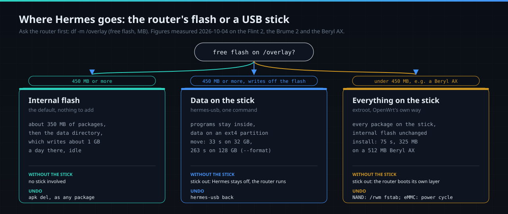
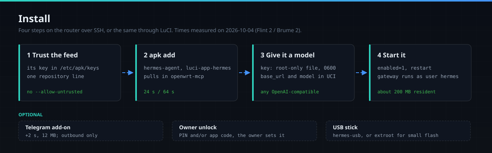
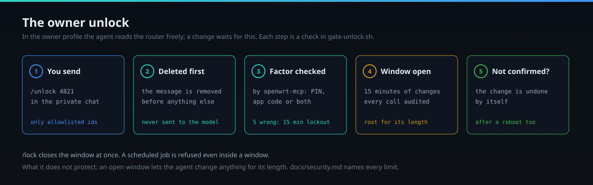
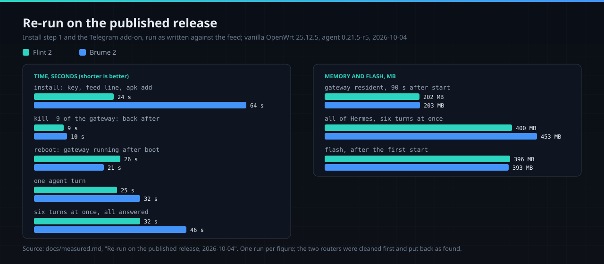

<div align="center">


# hermes-openwrt

[**Hermes Agent**](https://github.com/NousResearch/hermes-agent) packaged for the router
it runs on: an `apk` for OpenWrt 25.12, a signed feed, a LuCI page,
and figures measured on hardware rather than in a container.

[](https://github.com/TAIPANBOX/hermes-openwrt/actions/workflows/ci.yml)


</div>


## What it is, and what it is not

Hermes living on your router, inside your home network: an assistant for the network it sits
in, on all the time. The router runs the agent; a provider you choose runs the model, a free one
included. It has no browser, so it does not book, buy or sign in to sites, and it does search and
read ordinary web pages without a web API key.

| Use | What it looks like | Status |
|---|---|---|
| **The home network, from a phone** | "why is the internet slow?" in Telegram; it runs commands on the router and answers from their output | measured on both routers: a five-command diagnosis in 18 to 25 s; on a clean Flint 2 with 0.21.5-r9's ping, 9 s ([measured](docs/measured.md#the-agents-own-ping)) |
| **A watch that speaks only when something is wrong** | every hour a script collects loss, latency, DNS, memory, flash and temperature; the model reads them in one call and stays silent if all is normal | 19 hours on a Brume 2, one model call per check ([one way it stays silent](docs/use.md#scheduled-jobs-in-practice)) |
| **A morning message** | weather, the exchange rate and one news item at 08:00 | delivered on time; a small free model skipped the search it was asked for |
| **An assistant that is always on** | reminders and lists set in plain words in a chat | not measured yet |

For an agent that browses, books or signs in, run Hermes on a machine with 2 GB or more; the
router can still serve it as a narrow, audited tool provider through
[openwrt-mcp](https://github.com/TAIPANBOX/openwrt-mcp). More: [docs/use.md](docs/use.md).

## The routers it runs on


Three GL.iNet routers on **vanilla OpenWrt 25.12.5**, not their vendor firmware, chosen as three
shapes of one job: a Wi-Fi router, a wired gateway, and a 512 MB travel router that keeps Hermes
on a USB stick. Each card holds every figure for that router; each was cleaned of the package
first and put back as found. How every figure was taken: [docs/measured.md](docs/measured.md).

## Where it installs: the router's flash or a USB stick



| | When | What it takes | Without the stick | Undo |
|---|---|---|---|---|
| **Internal flash**, the default | 450 MB or more free on `/overlay` | nothing beyond [Install](#install) | no stick involved | `apk del` |
| **Data on the stick**, `hermes-usb` | the same, and you would rather keep the repeated writes off the router's flash | the USB packages, then one command (below) | Hermes stays off and says why; the router runs as usual | `hermes-usb back` |
| **Everything on the stick**, extroot | under 450 MB free, such as the Beryl AX (256 MB of NAND) | OpenWrt's extroot (format, fstab, copy, one reboot), then [Install](#install) as usual | the router boots its own layer, without Hermes | NAND: drop the two fstab sections under `/rwm` and reboot; eMMC: pull the stick and power-cycle |

The data on a stick, after [Install](#install):

```sh
apk update && apk add kmod-usb-storage block-mount kmod-fs-ext4 e2fsprogs
block info                            # the stick's partition: /dev/sda1 here
hermes-usb move /dev/sda1 --format    # erases that partition, makes ext4, moves the data
hermes-usb status
```

Extroot's commands, what each refuses, and every measurement: [docs/usb.md](docs/usb.md).

## Install

| You need | |
|---|---|
| **Router** | vanilla OpenWrt 25.12 (not a vendor firmware) on aarch64: `cat /etc/apk/arch` prints `aarch64_cortex-a53` or `aarch64_generic`. Tested on a Flint 2, a Brume 2 and a Beryl AX |
| **Memory** | 1 GB. On 512 MB one conversation at a time fits, with little to spare |
| **Flash** | about 350 MB for the packages, then the data directory (37 MB at the first start, growing). Short of flash: [a USB stick](#where-it-installs-the-routers-flash-or-a-usb-stick) |
| **A model** | a key for any OpenAI-compatible provider, free ones included; the service does not start without one |
| **A way back** | a backup kept off the router (`sysupgrade -b /tmp/backup.tar.gz`), and your router's vendor firmware at hand |



**1. Trust the feed and install.**

```sh
wget -O /etc/apk/keys/hermes-openwrt.pem \
  https://taipanbox.github.io/hermes-openwrt/hermes-openwrt.pem

echo "https://taipanbox.github.io/hermes-openwrt/25.12/$(cat /etc/apk/arch)/packages.adb" \
  >> /etc/apk/repositories.d/customfeeds.list

apk update && apk add hermes-agent luci-app-hermes
```

If apk ends with `N errors;` after `Connection aborted`, a download from OpenWrt's own server was
cut off: run the same `apk add` again until it ends with `OK:`.

No `--allow-untrusted` and no `--force`: that is the point of signing the feed. `hermes-agent`
pulls in `openwrt-mcp` from the same feed and creates the `hermes` account the agent runs as.

**2. Give it a model and start it.** The service ships switched off.

Typed in an SSH session on the router, `printf` is a shell builtin and the key never reaches a
command line another process can read; sending the same line as `ssh router "..."` would put
it in one.

```sh
printf '%s' 'sk-...' > /etc/hermes-agent/provider.key && chmod 600 /etc/hermes-agent/provider.key
uci set hermes.main.base_url='https://openrouter.ai/api/v1'   # any OpenAI-compatible endpoint
uci set hermes.main.model='openai/gpt-6.1-sol'               # see the note below on models
uci set hermes.main.enabled=1
uci commit hermes && /etc/init.d/hermes-agent restart
logread -e hermes | tail -n 20
```

Pick a strong model. On 2026-10-08, on a Flint 2 and a Brume 2 through Telegram, `gpt-6.1-sol`
pinged the gateway and the internet, checked DNS and the ports and reported only what it saw,
while `openai/gpt-4o-mini` with the same package looped on its memory tool, skipped the ping and
advised a reboot. On OpenRouter a diagnosis with `openai/gpt-6.1-sol` costs a few cents; a ChatGPT
subscription runs it at no extra cost, picked per chat (see below).

Or in the browser: **Services -> Hermes Agent -> Settings**. The key is a root-only file and the
page can write it but never read it back. Which models can drive it is measured
[below](#which-models-can-drive-it).

**3. Reach it from a phone** (optional).


The router opens no port: it polls Telegram outbound, so it works behind NAT and CGNAT. Only the
numeric ids you allow are answered, and the service refuses to start with nobody allowed rather
than answer nobody in silence. The token is a root-only file, like the key.

```sh
apk add hermes-agent-telegram
printf '%s' '<token from @BotFather>' > /etc/hermes-agent/telegram.token
chmod 600 /etc/hermes-agent/telegram.token
uci set hermes.telegram.enabled=1
uci add_list hermes.telegram.allow_user_id=<your numeric id, from @userinfobot>
uci commit hermes && /etc/init.d/hermes-agent restart
```

The first reply in a new chat may be Hermes's own onboarding question, which offers to build a
short profile of you; answer it, or send your message again. More, including what a first test
chat shows: [docs/telegram.md](docs/telegram.md).

**4. Let it change the router** (optional). In the default `owner` profile the agent reads the
router freely and changes it only after you unlock it with a second factor. With none set,
nothing can change the router through it. Set one in **Services -> Hermes Agent -> Security**,
or over SSH, where the QR code is printed in the terminal:

```sh
python3 -c 'import getpass; print(getpass.getpass("PIN: "))' | openwrt-mcp pin set hermes-main
openwrt-mcp mfa enrol hermes-main --pending --qr
openwrt-mcp mfa activate hermes-main <code from the app>
uci set hermes.security.factor=pin+totp    # none, pin, totp or pin+totp
uci commit hermes && /etc/init.d/hermes-agent restart
```

The first line reads the PIN without showing it, through the python3 the package already
needs (OpenWrt's BusyBox has no `stty`); run it in an SSH session with a terminal (`ssh -t`).
Then `/unlock` and the PIN in one message, `/unlock 4821`, in the private chat opens a 15-minute
window (`/unlock 4821 503917` with `pin+totp`; the digits alone work too). `/unlock` on its own
opens nothing: the bot answers with what to send. On the Security page the PIN and the factor
have a Save each, and a PIN unlocks nothing until the factor asks for it. The window is root for
its length: [how it keeps the router yours](#how-it-keeps-the-router-yours).

**Upgrading.** `apk update && apk upgrade hermes-agent luci-app-hermes openwrt-mcp` (and
`hermes-agent-telegram` if you added it), then `/etc/init.d/hermes-agent restart`: an upgrade
does not restart a running gateway, and it leaves the start at boot as you set it. Do not
install a fixed version with `apk add hermes-agent=<version>`: that pins it in
`/etc/apk/world`, and later upgrades silently keep the old one.

**Removing it.** If `hermes-usb status` says the data is on a stick, run `hermes-usb back` first.

```sh
/etc/init.d/hermes-agent stop
apk del luci-app-hermes hermes-agent-telegram hermes-agent openwrt-mcp
```

That leaves the data, the keys, the configuration and the `hermes` account, on purpose; how to
take all of it away is in [docs/install-notes.md](docs/install-notes.md#removing-it).

An agent doing this for you: [docs/agent-install.md](docs/agent-install.md) is the same install
written as checks an agent runs and the output it must see.

## How it keeps the router yours


Keys live in root-only files under `/etc/hermes-agent`. The LuCI page can write one and ask
whether one exists; no page and no call returns one, and keys stay out of command lines, UCI and
procd's service table.

| profile | runs as | the router |
|---|---|---|
| `owner` (default) | `hermes`, unprivileged | read through openwrt-mcp; changed only through it, after an unlock |
| `assistant` | `hermes`, no terminal, code or file tools | only through an MCP server you set up |
| `root` | root, warned at every start | directly, no unlock |



The owner unlocks from the private Telegram chat with a PIN, an app code or both. The message is
deleted before anything else and never reaches the model or a log; five wrong tries lock
unlocking for fifteen minutes. Your consent is the `/unlock` itself: after a change the agent
checks that the router still answers and confirms the change; one it does not confirm (the router
lost its connection, or the agent never got that far) is undone by itself after about 90 seconds,
after a reboot too. In a window the agent can change settings, the VPN and services; it cannot run a command
over ubus, write a file, flash a firmware or reboot, and openwrt-mcp refuses a setting that would
run code (a firewall include). The agent reads the Wi-Fi and network settings too,
so it can set up a guest network, but never a key in them: openwrt-mcp answers every Wi-Fi key,
WireGuard private key and password as `<redacted>`, and the package grants those reads only when
openwrt-mcp says it does that. Everything, with the limits named:
[docs/security.md](docs/security.md).

## Measured on hardware

The first full measurement, on the Flint 2 and the Brume 2 with **Hermes 0.21.5** on 2026-09-25,
where a conversation is a real diagnosis (`openai/gpt-4o-mini` running five commands through the
terminal tool):


| | GL-MT6000 (Flint 2) | GL-MT2500 (Brume 2) |
|---|---|---|
| SoC | MT7986, 4x Cortex-A53 | MT7981, 2x Cortex-A53 |
| RAM / free flash | 1 GB / 6.8 GB | 1 GB / 6.8 GB |
| `apk add hermes-agent luci-app-hermes`, from nothing | 17 s, 46 packages | 48 s, 45 packages |
| package tree (`/usr/lib` and `/usr/share/hermes-agent`) | 239 MB | 239 MB |
| `hermes --version`, cold | 2 s | 3 s |
| gateway resident | 179 MB | 178 MB |
| one conversation, end to end | 18 s | 25 s |
| six conversations at once | 25 s, all answered | 30 s, all answered |
| all of Hermes at six, memory | 361 MB | 379 MB |
| temperature, fanless | 51 to 52 C | 45 to 47 C |

### Re-run on the published release, 2026-10-04



Step 1 of [Install](#install) and the Telegram add-on, run as written against the published feed
(agent 0.21.5-r5), with `gpt-5.6-luna` through a ChatGPT subscription. The same figures are on the
router cards above; the full table is in
[docs/measured.md](docs/measured.md#re-run-on-the-published-release-2026-10-04).

### How many agents fit alongside your other services


- **Conversations in one gateway** (how Telegram serves several chats) are threads of a process
  already running: one to four at once kept all of Hermes flat at 388 MB on the Flint 2 and
  445 MB on the Brume 2.
- **Separate agents** are a Python interpreter each, about 140 MB: two fit under the default
  512 MB ceiling; a third fills it, and the service restarts.
- **With the ceiling lifted**, three fit on clean OpenWrt, leaving 201 to 216 MB.

Plan on conversations, not agents. While the routers did their own job, the Flint 2's house
traffic moved only by the line's own variation, with no loss, and a conversation took about a
quarter of the Brume 2's WireGuard throughput, less at nice 10, which is why the service runs at
nice 10. Details: [docs/measured.md](docs/measured.md).

### Which models can drive it


The same task for each, one turn on the Brume 2 through OpenRouter: read `/proc/uptime` with the
terminal tool and give the uptime in minutes.

| Model | Called the tool | Right | Wall clock | Note |
|---|---|---|---|---|
| `anthropic/claude-haiku-4.5` | yes | yes | 18 s | |
| `google/gemini-2.5-flash` | yes | yes | 4 s | |
| `openai/gpt-4o-mini` | yes | yes | 7 s | |
| `moonshotai/kimi-k2-0905` | yes | yes | 11 s | |
| `deepseek/deepseek-chat-v3.1` | yes | yes | 16 s | three calls where one would do |
| `qwen/qwen3-8b` | yes | yes | 14 s | 8B, and it works |
| `mistralai/mistral-small-3.2-24b-instruct` | yes | yes | 4 s | |
| `meta-llama/llama-3.3-70b-instruct` | cut off | no | 15 s | ran out of output tokens mid-call; Hermes refused to run the half-written command |
| `google/gemma-3-12b-it` | **no** | no | 5 s | printed the call as JSON text |

The floor is native tool calling, not size: an 8B model works, a 12B one without tool support
does not. Pick for function calling.

Changing the router asks more of a model than one tool call. On 2026-10-08, on a Brume 2 and a
Flint 2 through Telegram and openwrt-mcp, `gpt-6.1-sol` through a ChatGPT subscription ran the
diagnosis correctly, while `gpt-4o-mini` looped on its memory tool and made a wrong firewall
change. A subscription is signed in with `hermes-login chatgpt` and picked per chat with
`/model gpt-6.1-sol --provider openai-codex` ([docs/providers.md](docs/providers.md)).

## How it is built


Hermes 0.21.5 is assembled, not ported: pip on OpenWrt resolves musllinux wheels and every wheel
Hermes needs exists, so the package is built inside the OpenWrt release it targets, from one
pinned upstream commit, every library at upstream's locked version, with one shim
(`webbrowser`). [docs/build.md](docs/build.md).

### The signed feed

The index and every package are signed with an EC key through `apk adbsign`, and signing happens
on a workstation, never in CI: a router that trusts the key keeps trusting anything it signs.

## What it will not do

- **Run the model on the router.** A router CPU spends minutes on the agent's system prompt
  alone; the model lives elsewhere.
- **Fit a small router.** About 400 MB of flash and 200 MB of RAM before any work. 512 MB holds
  one conversation at a time, the packages on a stick (the Beryl AX above); below that, run
  openwrt-mcp on the router (4 MB of flash, 7.4 MB of memory, measured) and keep Hermes elsewhere.
- **Browse, see or draw.** Browser, vision, image generation and the wake-word stack are not
  packaged; `ffmpeg` is, for voice messages.

More than one provider at once, a ChatGPT subscription beside a key, `/model` per chat:
[docs/providers.md](docs/providers.md).

## Testing it for us

What helps most is what has not been measured yet:

1. **A reminder set in plain words in a chat**, and whether it arrives on time.
2. **The gateway's memory over days.** The longest run so far was 19 hours, and in its
   last 14.5 the gateway grew from 204 to 215 MB, too short to tell a leak from warming
   up. That figure is the gateway's own resident memory; every hour or so:
   `grep VmRSS /proc/$(pgrep -o -f '[m]ain.py gateway')/status`.
3. **Web search with the model you use.** It works on a router (see
   [the re-run](docs/measured.md#re-run-on-the-published-release-2026-10-04)), but
   whether a model reaches for it unasked depends on the model.
4. **Any aarch64 router other than the Flint 2, Brume 2 and Beryl AX**, with its numbers.

Report what happened in an [issue](https://github.com/TAIPANBOX/hermes-openwrt/issues/new/choose):
the template asks for the router, the versions and the log. Before you paste a log, look
for keys and tokens in it; the package keeps them out of its own lines, but a model's
reply or a command's output can carry anything. A security problem goes through
[SECURITY.md](SECURITY.md) instead, not an issue.

To change the code yourself, [CONTRIBUTING.md](CONTRIBUTING.md) says how to build what CI
builds, which checks cover which part, and what a pull request is held to.

## What is checked, and how

Nothing here is verified by reading the archive. Every gate installs the packages into
OpenWrt's own published rootfs and asks the running system. CI runs them on an arm64 runner
(the feed's gate runs when the feed is published), and teeth scripts plant faults in the
product and require a check to catch each one.

| gate | covers |
|---|---|
| `gate-package.sh` | install, start, the key out of sight, upgrade, clean removal |
| `gate-runtime.sh` | the gateway against the installed upstream: models, providers, profiles, limits |
| `gate-luci.sh` | the web page: write-only keys, the narrow read permission, the Security page |
| `gate-unlock.sh` | the owner unlock end to end, from Telegram and from LuCI |
| `gate-usb.sh` | `hermes-usb` with real sticks made of loop devices |
| `gate-telegram.sh`, `gate-upstream.sh`, `gate-feed.sh` | the add-on, the pinned upstream, the signed feed |
| `gate-upstream-watch.sh` | the daily check that opens one issue when upstream tags a newer release |
| `gate-apk-owner.sh`, `gate-relabel.sh` | every file in every package is root's; the `aarch64_cortex-a53` package differs from the generic one only in its label |
| `gate-figures.sh` | these figures drawn from their data; every picture, link and anchor resolves |

What each check proves, one by one: [docs/checks.md](docs/checks.md).

## More

| | |
|---|---|
| [docs/use.md](docs/use.md) | what it is for, scheduled jobs, what it will not do |
| [docs/install-notes.md](docs/install-notes.md) | requirements in detail, a way back, removing everything |
| [docs/agent-install.md](docs/agent-install.md) | the install as an agent runs it |
| [docs/measured.md](docs/measured.md) | every hardware figure |
| [docs/usb.md](docs/usb.md) | `hermes-usb` and extroot |
| [docs/security.md](docs/security.md) | keys, profiles, the unlock, the controls |
| [docs/providers.md](docs/providers.md) | several providers and a ChatGPT subscription |
| [docs/telegram.md](docs/telegram.md) | the phone, the allowlist, a test chat |
| [docs/build.md](docs/build.md) | how it is built, the feed, status |
| [docs/checks.md](docs/checks.md) | every gate and its teeth |
| [CONTRIBUTING.md](CONTRIBUTING.md) · [SECURITY.md](SECURITY.md) | changing it, reporting a vulnerability |
