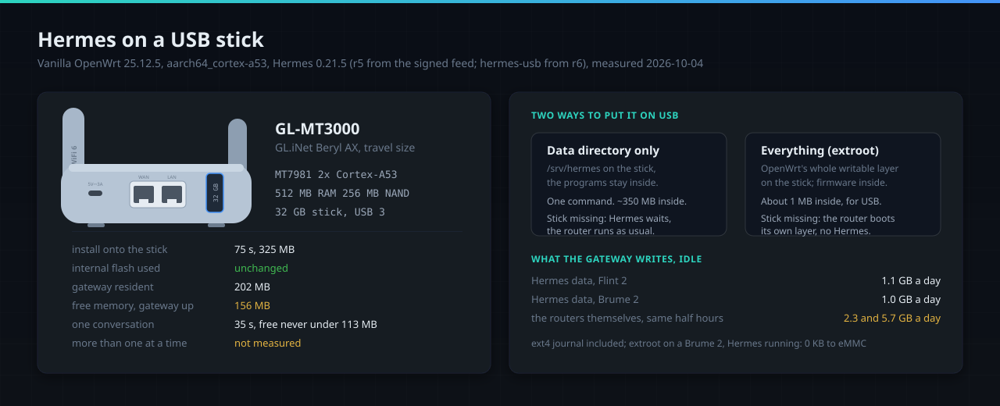

# Hermes on a USB stick



Hermes installs to the router's own storage by default. What wears flash is what is written
again and again, and for Hermes that is its data directory (sessions,
memory, logs, its state database); the programs are written once, at install. Measured on
2026-10-04 with the data directory alone on a stick (`/proc/diskstats`, 30 minutes each): an
idle gateway wrote about 1.1 GB a day on the Flint 2 and 1.0 GB a day on the Brume 2, the ext4
journal included. In those half hours these lab routers, with Tailscale and other services
running, wrote 2.3 and 5.7 GB a day to their own eMMC; across the windows measured that day
their own writes ranged from 2 to 6 GB a day.

A stick is an option for anyone who would rather keep a service's writes on something they can
replace, and the only way in for a router with too little flash. There are two ways.

**The data on a stick: `hermes-usb`.** One command moves the data directory to a stick and
mounts it there at every boot; the programs stay inside, and the router never depends on the
stick. Without it Hermes does not start, and says why, rather than start empty on the
router's own storage: the service, the gateway's own restarts, a `hermes` command pointed at
the data directory and the ChatGPT sign-in (when it starts) all ask the same. When the stick is
plugged in and mounted, an enabled Hermes starts by itself, a stick late at boot included; when
it goes, Hermes stops. Another USB device coming or going changes nothing. Everything else on
the router runs as before. In the root profile the gateway runs as root, so in the seconds
between the stick going and the stop, what it writes lands under the empty mount point on the
router's own storage, hidden once the stick is back; the owner and assistant profiles run it as
`hermes`, which cannot write there.

```sh
apk update && apk add kmod-usb-storage block-mount kmod-fs-ext4 e2fsprogs
block info                            # the stick's partition: /dev/sda1 here
hermes-usb move /dev/sda1 --format    # erases that partition, makes ext4, moves the data
hermes-usb status
```

`hermes-usb back` brings the data inside again, and the stick can then be removed. A stick
that is lost is given up with `hermes-usb forget --yes`: its data stays on it, and Hermes
starts again with an empty data directory inside. Without `--format` it takes only an empty
ext4 partition. It takes only a partition of a USB disk, never a whole disk and never the
router's own storage, and refuses, changing nothing, a disk with another partition mounted, a
data directory that is already a mount point, reached through a symbolic link, on another
filesystem or named in the fstab, a stick without room for the data plus 64 MiB (checked before
`--format` erases anything), and a router without the packages above, whose `apk add` line it
prints. It switches nothing unless every file's checksum matches, and it waits for the
gateway's process, not its pid file, which the gateway removes before its last write. Nothing
is ever moved into a directory that exists, and the copy inside is set aside under a fixed
name until the stick is mounted and checked: if a power cut stops it half way, Hermes does not
start and names that copy, so nothing is lost and nothing is guessed. While it runs, nothing
else starts Hermes, a `hermes` command from a root shell included, and it refuses to move a
directory another process has a file open in. The stick's record is read back from
`/etc/config/fstab` itself before anything inside is let go: on a full filesystem `uci commit`
was seen to report success and leave that file empty, so the command checks for room first,
commits only with a copy of the file kept in RAM, puts the file back as it was when a commit
does not land (read back by uci itself: another section missing, the file left empty or cut off
inside a value counts as not landed), and refuses to run while someone
else's fstab changes wait uncommitted rather than commit them along. `--format` writes every inode table at once (a freshly made ext4 otherwise
goes on writing by itself for hours, which looks exactly like a service wearing the stick) and
reserves no blocks for root, which the agent, running as `hermes`, could not use.

Run end to end with 0.21.5-r6 on a Brume 2 (a 32 GB stick) and a Flint 2 (a 128 GB stick): on the
Brume still without the USB packages `hermes-usb` printed the `apk add` line and changed nothing;
`move --format` took 33 s and 263 s (writing every inode table is what takes the time, and it
grows with the stick); after a reboot with the stick in, one gateway was running on it 19 s and
11 s after boot; pulling the stick stopped Hermes, with nothing left running and nothing written
inside; a reboot without the stick brought the router up normally, with Hermes refusing to start
and saying why; plugging the stick back started Hermes on it; and `back` brought 373 files inside
in 12 s and 8 s. With the record then read back from the file on flash and the other users of
the data directory checked, `move --format` and `back` ran again on the Brume (30 s and 12 s),
and between them it refused, changing nothing, while someone else's fstab change waited
uncommitted and while another process held a file open on the stick.

**Everything on a stick: extroot.** OpenWrt's own way to put the router's whole writable
layer on a stick: every package installed afterwards, Hermes or any other, lands there, and
the internal flash keeps only the firmware. It is the way in for a router with too little
flash, such as the Beryl AX, and it moves the router's configuration to the stick too. A
configured router keeps its settings: they are copied to the stick before the switch.

```sh
apk update && apk add kmod-usb-storage block-mount kmod-fs-ext4 e2fsprogs
mkfs.ext4 -F -L hermes-root -E lazy_itable_init=0,lazy_journal_init=0 /dev/sda1   # erases it
[ -f /etc/config/fstab ] || block detect | uci import fstab
UUID=$(block info /dev/sda1 | grep -o 'UUID="[^"]*"' | cut -d'"' -f2)
ORIG=$(block info | sed -n -e '/MOUNT="\S*\/overlay"/s/:\s.*$//p')
uci set fstab.extroot=mount; uci set fstab.extroot.uuid="$UUID"; uci set fstab.extroot.target=/overlay
uci set fstab.rwm=mount; uci set fstab.rwm.device="$ORIG"; uci set fstab.rwm.target=/rwm
uci commit fstab
mkdir -p /mnt/x && mount /dev/sda1 /mnt/x && tar -C /overlay -cf - . | tar -C /mnt/x -xf - && umount /mnt/x
reboot
```

After the reboot `df -h /` shows the stick's size; then install Hermes with the
[Install](../README.md#install) block as usual. Measured on 2026-10-04, with the stick made without the
`-E` option (it only stops the background writing described below) and, on the Beryl AX,
formatted whole as `/dev/sda`:

| | Beryl AX (512 MB, NAND) | Brume 2 (1 GB, eMMC) |
|---|---|---|
| the Install block, onto the stick | 75 s, 52 packages, 325 MB | 59 s, 52 packages, 320 MB |
| internal flash during the install | space used unchanged, 828 KB | 0 MB written |
| internal flash, Hermes running, 10 min | | 0 KB written |
| gateway resident / memory left free | 202 MB / 156 MB | |
| one conversation (a diagnosis through the terminal tool, free model) | 35 s, never under 113 MB free | |
| more than one conversation at once | not measured | |

On 512 MB, one conversation at a time fits and the margin is thin. Undoing it differs by
storage. On the Beryl AX (NAND) the internal layer is mounted at `/rwm`, so removing the
`extroot` and `rwm` sections from `/rwm/upper/etc/config/fstab` and rebooting undoes it,
measured. On the Brume 2 (eMMC, the internal layer an f2fs on a loop device) OpenWrt 25.12
mounts no `/rwm` and the internal layer cannot be reached while the router runs from the
stick: take the stick out and power the router off and on. Measured on 2026-10-04: the
router came up on its own layer, as it was at the switch ("extroot: cannot find device ...
switching to f2fs overlay"), with its address and Tailscale up. The Flint 2 mounts its
internal layer at `/rom/overlay`, where the commands above do not apply as written: a first
attempt there stopped before the switch, when the check of its copy refused.

A freshly made ext4 writes on its own for hours (`ext4lazyinit`): on 2026-10-04 a new
128 GB stick took about 140 KiB/s with Hermes stopped. Make it with `-E
lazy_itable_init=0,lazy_journal_init=0`, as both commands here do, before reading anything
into a stick's write counters.
